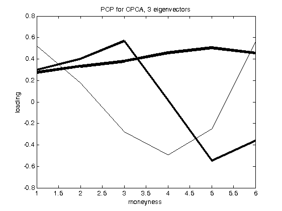

[](http://quantlet.de/)

## [](http://quantlet.de/) **MVAcpcaiv** [](http://quantlet.de/)

```yaml

Name of QuantLet: MVAcpcaiv

Published in: Applied Multivariate Statistical Analysis

Description: 'Estimates a common principal components model for the implied volatility 
              data and computes a likelihood ratio test. The computation of the common 
              principal components uses a part of the code of the function "FCPC" that 
              belongs to the R-Package "multigroup" (https://CRAN.R-project.org/package=multigroup).'

Keywords: 'principal-components, pca, eigenvalues, plot, graphical representation, 
          data visualization, common-principal-component, cpc, volatility, 
          implied-volatility, likelihood-ratio-test.'

See also: 'MVAnpcabanki, MVAnpcabank, MVAnpcahousi, MVAnpcatime, MVAnpcafood, MVAnpcausco, 
           MVAnpcausco2, MVAnpcausco2i, MVApcabank, MVAnpcahous, MVApcabanki, MVApcabankr, 
           MVApcasimu'

Author: Piedad Castro

Submitted: Fri, Nov 11 2016 by Piedad Castro

Datafile: XFGvolsurf01.dat, XFGvolsurf02.dat, XFGvolsurf03.dat

Output: 'Plot of the factor loadings of the first (thick), the second (medium) 
         and the third (thin) common principal components.'


```




### MATLAB Code
```matlab

%% clear all variables and console and close windows
clear
clc
close all

%% set directory
% cd('\\tsclient\D\Trabajo HU\AAA-MVA')

%% data import
data1 = load('XFGvolsurf01.dat');  % 1 month maturity data
data2 = load('XFGvolsurf02.dat');  % 2 months maturity data
data3 = load('XFGvolsurf03.dat');  % 3 months maturity data

%% sample covariance matrices
C          = cov(data1); 
C(:, :, 2) = cov(data2); 
C(:, :, 3) = cov(data3); 

K  = size(C,3);     % number of groups
P  = size(C, 1);    % number of variables

%% CPCA computation
L  = 15;            % number of iterations
B  = eye(P);
d1 = zeros(K, 1);
d2 = zeros(K, 1);
for l = 1:L
  for p = 1:(P - 1)
    for e = (p + 1):P
      Q = eye(2);
      M = eye(2);
      for k = 1:K
        H          = B(: ,[p, e]);
        T(:, :, k) = H' * C(:, :, k) * H;
        d1(k)      = Q(:, 1)' * T(:, :, k) * Q(:, 1);
        d2(k)      = Q(:, 2)' * T(:, :, k) * Q(:, 2);
        M          = M + (d1(k) - d2(k))/(d1(k) * d2(k)) * T(:, :, k);
      end
      [EigVec, EigVal] = eig(M);
      Q = EigVec;
      B(: ,[p, e]) = H * Q;
    end
  end
end

%% sort eigenvectors
NewB = [];
absi = abs(sum(B, 1));
while sum(absi) > -size(B,2)    
    maxi        = max(absi);
    index       = find(absi == maxi);    
    NewB        = [NewB B(:,index)];
    absi(index) = -1;
end

%% plot 
figure
set(gcf,'color','w')            % set the background color to white
plot(-NewB(:, 1), 'black', 'LineWidth', 5)
ylim([-0.8 0.8])
title('PCP for CPCA, 3 eigenvectors')
xlabel('moneyness')
ylabel('loading')
hold on
plot(NewB(:, 2), 'black', 'LineWidth', 3)
plot(-NewB(:, 3), 'black', 'LineWidth', 1)

%% test statistic
test = 0;
n    = [size(data1, 1), size(data2, 1), size(data3, 1)]; % number of observations per group
for k = 1:K
    lambda(:, :, k) = diag(diag(NewB' * C(:, :, k) * NewB));
    Sig(:, :, k)    = NewB * lambda(:, :, k) * NewB';
    test            = test + (n(k)-1) * det(Sig(:, :, k))/det(C(:, :, k));
end

%% p-value
df   = 1/2 * (K - 1) * P * (P - 1);
pval = 1 - chi2cdf(test, df);

```

automatically created on 2018-05-28

### R Code
```r

# clear variables and close windows
rm(list = ls(all = TRUE))
graphics.off()

# set working directory
# setwd("C:/...")

# load data
data1 = read.table("XFGvolsurf01.dat")  # 1 month maturity data
data2 = read.table("XFGvolsurf02.dat")  # 2 months maturity data
data3 = read.table("XFGvolsurf03.dat")  # 3 months maturity data

K      = length(C)            # number of groups
P      = dim(data1)[2]        # number of variables

# sample covariance matrices
C      = vector("list", K)
C[[1]] = cov(data1)
C[[2]] = cov(data2)
C[[3]] = cov(data3) 

# CPCA computation
L = 15  # number of iterations
B = diag(P)
T = vector("list", K)
d1 = rep(0, K)
d2 = rep(0, K)

for (l in 1:L) {
  for (p in 1:(P - 1)) {
    for (e in (p + 1):P) {
      Q = diag(2)
      M = diag(2)
      for (k in 1:K) {
        H = B[, c(p, e)]
        T[[k]] = t(H) %*% C[[k]] %*% H
        d1[k] = t(Q[, 1]) %*% T[[k]] %*% Q[, 1]
        d2[k] = t(Q[, 2]) %*% T[[k]] %*% Q[, 2]
        M = M + (d1[k] - d2[k])/(d1[k] * d2[k]) * T[[k]]
      }
      eig <- eigen(M)
      Q = eig$vectors
      B[, c(p, e)] = H %*% Q
    }
  }
}

# plot the first three eigenvectors
plot(-B[, 1], type = "l", lwd = 5, 
     ylim = c(-0.8, 0.8), xlab = "moneyness", ylab = "loading", 
     main = "PCP for CPCA, 3 eigenvectors")
lines(B[, 2], type = "l", lwd = 3)
lines(B[, 3], type = "l", lwd = 1)

# test statistic
test   = 0
n      = c(nrow(data1), nrow(data2), nrow(data3)) # number of observations per group
lambda = array(NA, c(P, P, K))# 3D array to store the diagonal matrices of eigenvalues
Sig    = array(NA, c(P, P, K))# 3D array to store the estimated covariance matrices

for(k in 1:K){
  lambda[, , k] = diag(diag(t(B) %*% C[[k]] %*% B))
  Sig[, , k]    = B %*% lambda[, , k] %*% t(B)
  test          = test + (n[k]-1) * det(Sig[, , k])/det(C[[k]])
}

# p-value
df   = 1/2 * (K - 1) * P * (P - 1)
pval = 1 - pchisq(test, df)


```

automatically created on 2018-05-28