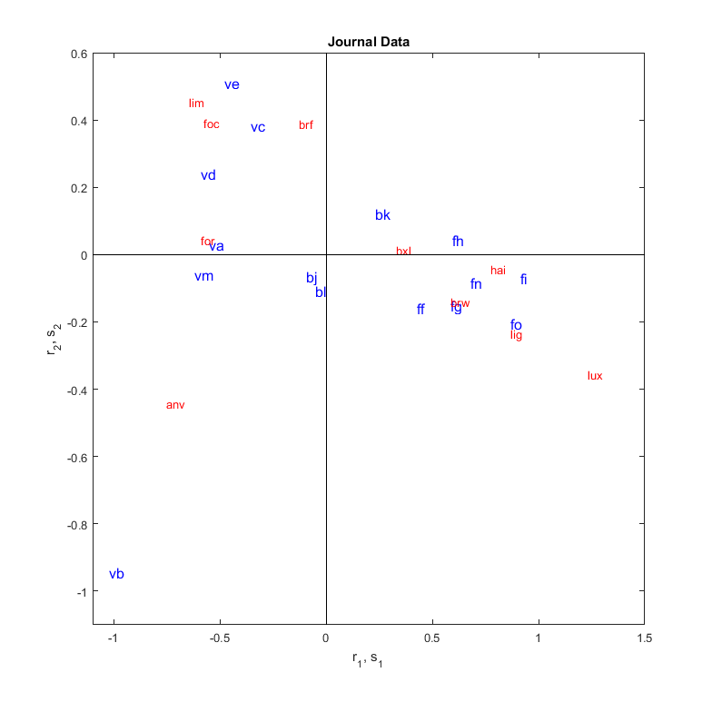
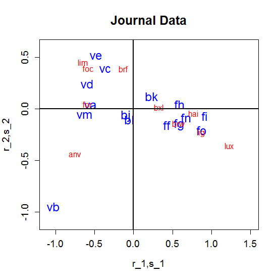

[](http://quantlet.de/)

## [](http://quantlet.de/) **MVAcorrjourn** [](http://quantlet.de/)

```yaml

Name of QuantLet: MVAcorrjourn

Published in: Applied Multivariate Statistical Analysis

Description: Performs a correspondence analysis for the Belgian journal data, shows the eigenvalues of the singular value decomposition of the chi-matrix and displays graphically its factorial decomposition.

Keywords: correspondence-analysis, svd, decomposition, factorial-decomposition, eigenvalues, factorial, plot, graphical representation, data visualization, sas

See also: MVAcorrCar, MVAcorrEyeHair, MVAcorrbac, MVAcorrcrime, SMScorrcrime, SMScorrcarm, SMScorrfood, SMScorrhealth

Author: Zografia Anastasiadou
Author[SAS]: Svetlana Bykovskaya
Author[Matlab]: Wolfgang K. Härdle, Jorge Patron, Vladimir Georgescu, Song Song

Submitted: Tue, May 10 2011 by Zografia Anastasiadou
Submitted[SAS]: Tue, April 05 2016 by Svetlana Bykovskaya
Submitted[Matlab]: Fri, December 16 by Piedad Castro

Datafile: journaux.dat

Note: 'Matlab and SAS decompose matrices differently than R, and therefore some 
      of the eigenvectors may have different signs.'

```






### MATLAB Code
```matlab

%% clear all variables and console and close windows
clear
clc
close all

%% load data
x = load('journaux.dat');

a = sum(x, 2);
b = sum(x);
e = a * b/sum(a);

% Chi-matrix
cc = (x - e)./sqrt(e);

[g1, l1, d1] = svd(cc);

% change the sign of some columns in g and d. This is done to get the same
% results as R.
g            = g1(:,1:10)
g(:,[2:4 9]) = -g(:,[2:4 9]);
l            = diag(l1)';
d            = d1;
d(:,[2:4 9]) = -d(:,[2:4 9]);

ll = l.*l;

aux  = cumsum(ll)./sum(ll);
perc = [ll',aux'];
r1   = repmat(l, 15 ,1).*g;         % multiplies each column of g with each corresponding element of l
r    = r1./repmat(sqrt(a), 1, 10);  % divides each row of r1  with each corresponding element of sqrt(a)
s1   = repmat(l, 10, 1).*d;         % multiplies each column of d with each corresponding element of l
s    = s1./repmat(sqrt(b)', 1, 10); % divides each row of s1  with each corresponding element of sqrt(b)

rr = r(:,1:2);
ss = s(:,1:2);

% names of the labels in graph
types   = ['va'; 'vb'; 'vc'; 'vd'; 've'; 'ff'; 'fg'; 'fh'; 'fi'; 'bj';
           'bk'; 'bl'; 'vm'; 'fn'; 'fo'];
regions = ['brw'; 'bxl'; 'anv'; 'brf'; 'foc'; 'for'; 'hai'; 'lig'; 
           'lim'; 'lux'];

hold on
text(rr(:,1), rr(:,2), types, 'Color', 'b', 'FontSize',12)
text(ss(:,1), ss(:,2), regions, 'Color', 'r', 'FontSize',10);
set(gca,'box','on')
line([-1.5 1.5], [0 0], 'Color', 'k')
line([0 0], [0.6 -1.4], 'Color', 'k')
xlim([-1.1 1.5])
ylim([-1.1 0.6])
title('Journal Data')
xlabel('r_1, s_1')
ylabel('r_2, s_2')

```

automatically created on 2018-05-28

### R Code
```r


# clear all variables
rm(list = ls(all = TRUE))
graphics.off()

# load data
x  = read.table("journaux.dat")
a  = rowSums(x)
b  = colSums(x)
e  = matrix(a) %*% b/sum(a)

# chi-matrix
cc = (x - e)/sqrt(e)

# singular value decomposition
sv = svd(cc)
g  = sv$u
l  = sv$d
d  = sv$v

# eigenvalues
ll = l * l

# cumulated percentage of the variance
aux  = cumsum(ll)/sum(ll)
perc = cbind(ll, aux)
r1   = matrix(l, nrow = nrow(g), ncol = ncol(g), byrow = T) * g
r    = r1/matrix(sqrt(a), nrow = nrow(g), ncol = ncol(g), byrow = F) 
s1   = matrix(l, nrow = nrow(d), ncol = ncol(d), byrow = T) * d
s    = s1/matrix(sqrt(b), nrow = nrow(d), ncol = ncol(d), byrow = F) 

car  = matrix(matrix(a), nrow = nrow(r), ncol = ncol(r), byrow = F) * r^2/matrix(l^2, 
    nrow = nrow(r), ncol = ncol(r), byrow = T)                   # contribution in r

cas  = matrix(matrix(b), nrow = nrow(s), ncol = ncol(s), byrow = F) * s^2/matrix(l^2, 
    nrow = nrow(s), ncol = ncol(s), byrow = T)                   # contribution in s

rr   = r[, 1:2]
ss   = s[, 1:2]

# labels for journals
types    = c("va", "vb", "vc", "vd", "ve", "ff", "fg", "fh", "fi", "bj", "bk", "bl", 
    "vm", "fn", "fo")

# labels for regions
regions  = c("brw", "bxl", "anv", "brf", "foc", "for", "hai", "lig", "lim", "lux")

# plot
plot(rr, type = "n", xlim = c(-1.1, 1.5), ylim = c(-1.1, 0.6), xlab = "r_1,s_1", 
    ylab = "r_2,s_2", main = "Journal Data", cex.axis = 1.2, cex.lab = 1.2, cex.main = 1.6)
points(ss, type = "n")
text(rr, types, cex = 1.5, col = "blue")
text(ss, regions, col = "red")
abline(h = 0, v = 0, lwd = 2)

```

automatically created on 2018-05-28

### SAS Code
```sas


* Import the data;
data journaux;
  infile '/folders/myfolders/data/journaux.dat';
  input temp1-temp10;
run;

proc iml;
  * Read data into a matrix;
  use journaux;
    read all var _ALL_ into x; 
  close journaux;
  
  a = x[,+];
  b = x[+,];
  e = a * b / sum(a);
  
  * chi-matrix;
  cc = (x - e)/sqrt(e);
  
  * singular value decomposition;
  call svd(u,q,v,cc);
  
  * eigenvalues;
  qq = q # q;
  
  * cumulated percentage of the variance;
  aux  = cusum(qq)/sum(qq);
  perc = qq || aux;
  r1   = repeat(q`, nrow(u), 1) # u;
  r    = r1 / repeat(sqrt(a), 1, ncol(u));
  s1   = repeat(q`, nrow(v), 1) # v;
  s    = s1 / repeat(sqrt(b)`, 1, ncol(v));
  
  * contribution in r;
  car = repeat(a, 1, ncol(r)) # (r ## 2) / repeat((q ## 2)`, nrow(r), 1);
  
  * contribution in s;
  cas = repeat(b`, 1, ncol(s)) # (s ## 2) / repeat((q ## 2)`, nrow(s), 1);
  
  rr = r[, 1:2];
  ss = s[, 1:2];
  
  types = {"va", "vb", "vc", "vd", "ve", "ff", "fg", "fh", 
    "fi", "bj", "bk", "bl", "vm", "fn", "fo"};   * labels for journals;
  regions = {"brw", "bxl", "anv", "brf", "foc", "for", 
    "hai", "lig", "lim", "lux"};                 * labels for regions;
  
  x1  = rr[,1];
  x2  = -rr[,2]; 
  x3  = ss[,1];
  x4  = -ss[,2]; 
      
  create plot var {"x1" "x2" "x3" "x4" "types" "regions"};
    append;
  close plot;
quit;

proc sgplot data = plot
    noautolegend;
  title 'Journal Data';
  scatter x = x1 y = x2 / markerattrs = (color = blue symbol = circlefilled)
    datalabel = types;
  scatter x = x3 y = x4 / markerattrs = (color = red symbol = circlefilled)
    datalabel = regions;
  refline 0 / lineattrs = (color = black);
  refline 0 / axis = x lineattrs = (color = black);
  xaxis label = 'r_1,s_1';
  yaxis label = 'r_2,s_2';
run;
```

automatically created on 2018-05-28