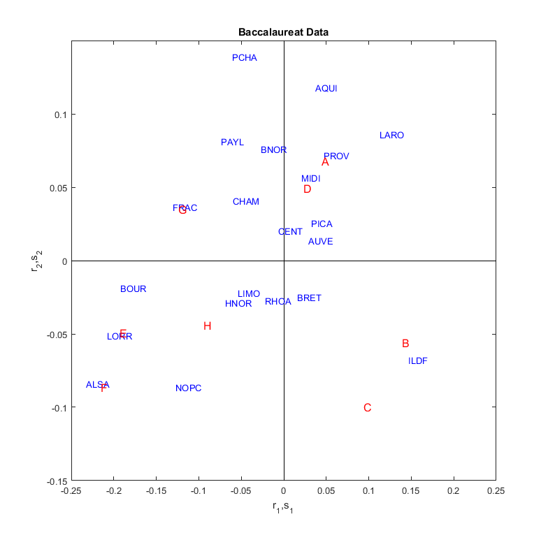
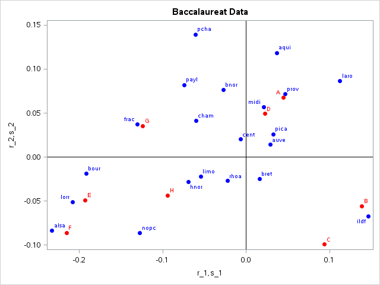
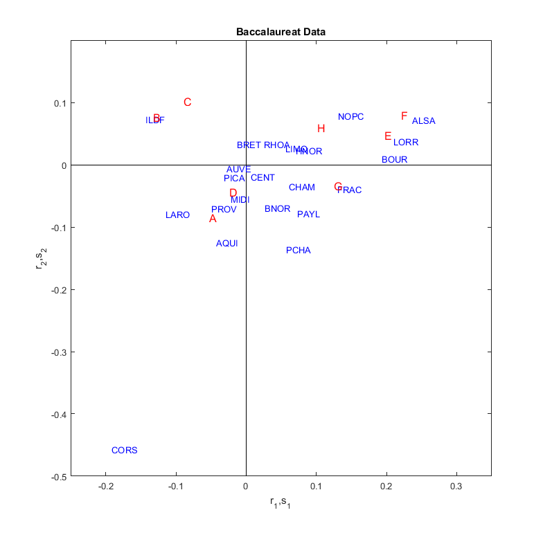

[](http://quantlet.de/)

## [](http://quantlet.de/) **MVAcorrbac** [](http://quantlet.de/)

```yaml

Name of QuantLet: MVAcorrbac

Published in: Applied Multivariate Statistical Analysis

Description: Performs a correspondence analysis for the baccalaureat data, shows the eigenvalues of the singular value decomposition of the chi-matrix and displays graphically its factorial decomposition.

Keywords: correspondence-analysis, svd, decomposition, factorial-decomposition, eigenvalues, factorial, plot, graphical representation, data visualization, sas

See also: MVAcorrCar, MVAcorrEyeHair, MVAcorrcrime, MVAcorrjourn, SMScorrcrime, SMScorrcarm, SMScorrfood, SMScorrhealth

Author: Zografia Anastasiadou
Author[SAS]: Svetlana Bykovskaya
Author[Matlab]: Wolfgang K. Härdle, Jorge Patron, Vladimir Georgescu, Song Song

Submitted: Fri, December 16 by Piedad Castro
Submitted[SAS]: Wed, April 06 2016 by Svetlana Bykovskaya
Submitted[Matlab]: Fri, December 16 by Piedad Castro

Datafile: bac.dat

Output: 
- 1: Plot without Corsica
- 2: Plot with Corsica

```









### MATLAB Code
```matlab

%% clear all variables and console and close windows
clear
clc
close all

%% Choose whether or not to include Corsica in the analysis.
disp('Would you like to include Corsica? If yes please enter [Cors]=1, if no [Cors]=0')
disp(' ')
Cors=input('[Cors]=');

while length(Cors)<1
    disp('Please input choice.')
    disp(' ')
    Cors=input('[Cors]=');
end

while (Cors~=0 && Cors~=1)
    disp('Wrong input. Please correct')
    disp('')
    Cors=input('[Cors]=');
end

%% load data
formatSpec = '%s%f%f%f%f%f%f%f%f';
data       = readtable('bac.dat', 'ReadVariableNames', false, 'Format', formatSpec);
x          = data;
x.Var1     = [];
x          = table2array(x);

if Cors==0
    x = x(1:end-1, :);
end

a = sum(x, 2);
b = sum(x);
e = a * b/sum(a);

%% Chi-matrix
cc = (x - e)./sqrt(e);

[g1,l1,d1] = svd(cc);

g = g1(:, 1:8);
d = d1;

l = diag(l1)';

%% Eigenvalues and percentages
ll   = l.*l;
aux  = cumsum(ll)./sum(ll);
perc = [ll', aux'];
r1   = repmat(l, length(g), 1).*g;       % multiplies each column of g with each corresponding element of l
r    = r1./repmat(sqrt(a), 1, 8)*(-1);   % divides each row of r1  with each corresponding element of sqrt(a)
s1   = repmat(l, length(d), 1).*d;       % multiplies each column of d with each corresponding element of l
s    = s1./repmat(sqrt(b)', 1, 8)*(-1);  % divides each row of s1  with each corresponding element of sqrt(b)

rr = r(:, 1:2);
ss = s(:, 1:2);

%% plot
hold on
title('Baccalaureat Data');
xlabel('r_1,s_1');
ylabel('r_2,s_2');
line([-0.8 0.8], [0 0], 'Color', 'k')
line([0 0], [0.8 -0.8], 'Color', 'k')
set(gca, 'box', 'on')

if Cors==0
    xlim([-0.25 0.25])
    ylim([-0.15 0.15])
else   
    xlim([-0.25 0.35])
    ylim([-0.5 0.2])
end

% labels of the regions
if Cors==0
    regions = char(data.Var1(1:end-1));
else
    regions = char(data.Var1);
end

text(rr(:, 1), rr(:, 2), regions, 'Color', 'b', 'Fontsize', 10)

modalities = ['A'; 'B'; 'C'; 'D'; 'E'; 'F'; 'G'; 'H'];

text(ss(:, 1), ss(:, 2), modalities, 'Color', 'r', 'Fontsize', 12);
hold off

```

automatically created on 2018-05-28

### R Code
```r


# clear all variables
rm(list = ls(all = TRUE))
graphics.off()

# load data
data     = read.table("bac.dat")
x1       = data[, 2:ncol(data)]
wcors    = 0                   # set to 0/1 to ex/include Corsica
wcorsica = c(rep(1, nrow(x1) - 1), wcors)
x        = subset(x1, wcorsica == 1)
a        = rowSums(x)
b        = colSums(x)
e        = matrix(a) %*% b/sum(a)

# chi-matrix
cc   = (x - e)/sqrt(e)

# singular value decomposition
sv   = svd(cc)
g    = sv$u
l    = sv$d
d    = sv$v

# eigenvalues
ll   = l * l

# cumulated percentage of the variance
aux  = cumsum(ll)/sum(ll)
perc = cbind(ll, aux)

r1   = matrix(l, nrow = nrow(g), ncol = ncol(g), byrow = T) * g
r    = (r1/matrix(sqrt(a), nrow = nrow(g), ncol = ncol(g), byrow = F)) * (-1)

s1   = matrix(l, nrow = nrow(d), ncol = ncol(d), byrow = T) * d
s    = (s1/matrix(sqrt(b), nrow = nrow(d), ncol = ncol(d), byrow = F)) * (-1)

car  = matrix(matrix(a), nrow = nrow(r), ncol = ncol(r), byrow = F) * r^2/matrix(l^2, 
    nrow = nrow(r), ncol = ncol(r), byrow = T)           # contribution in r

cas  = matrix(matrix(b), nrow = nrow(s), ncol = ncol(s), byrow = F) * s^2/matrix(l^2, 
    nrow = nrow(s), ncol = ncol(s), byrow = T)           # contribution in s

rr   = r[, 1:2]
ss   = s[, 1:2]

# labels for modalities
types   = c("A", "B", "C", "D", "E", "F", "G", "H")
if (wcors == 0) {
    # labels for regions
    regions = as.character(data[1:(nrow(data)-1),1])
    # plot 1
    plot(rr, type = "n", xlim = c(-0.25, 0.15), ylim = c(-0.15, 0.15), xlab = "r_1,s_1", 
        ylab = "r_2,s_2", main = "Baccalaureat Data", cex.axis = 1.2, cex.lab = 1.2, 
        cex.main = 1.6)
    points(ss, type = "n")
    text(rr, regions, col = "blue")
    text(ss, types, cex = 1.5, col = "red")
    abline(h = 0, v = 0, lwd = 2)
} else {
    # labels for regions
    regions = as.character(data[,1])
    # plot 2
    plot(rr, type = "n", xlim = c(-0.2, 0.25), ylim = c(-0.5, 0.15), xlab = "r_1,s_1", 
        ylab = "r_2,s_2", main = "Baccalaureat Data", cex.axis = 1.2, cex.lab = 1.2, 
        cex.main = 1.6)
    points(ss, type = "n")
    text(rr, regions, col = "blue")
    text(ss, types, cex = 1.5, col = "red")
    abline(h = 0, v = 0, lwd = 2)
}

```

automatically created on 2018-05-28

### SAS Code
```sas


* Import the data;
data bac;
  infile '/folders/myfolders/data/bac.dat';
  input temp1 $ temp2-temp9;
run;

proc iml;
  * Read data into a matrix;
  use bac;
    read all var _ALL_ into x; 
  close bac;
  
  n1 = nrow(x);
  wcors = 0;   * set to 0/1 to ex/include Corsica;
  if (wcors = 0) then x = x[1:n1-1,];
  
  a = x[,+];
  b = x[+,];
  e = a * b / sum(a);
  
  * chi-matrix;
  cc = (x - e)/sqrt(e);
  
  * singular value decomposition;
  call svd(u,q,v,cc);
  
  * eigenvalues;
  qq = q # q;
  
  * cumulated percentage of the variance;
  aux  = cusum(qq)/sum(qq);
  perc = qq || aux;
  r1   = repeat(q`, nrow(u), 1) # u;
  r    = r1 / repeat(sqrt(a), 1, ncol(u));
  s1   = repeat(q`, nrow(v), 1) # v;
  s    = s1 / repeat(sqrt(b)`, 1, ncol(v));
  
  * contribution in r;
  car = repeat(a, 1, ncol(r)) # (r ## 2) / repeat((q ## 2)`, nrow(r), 1);
  
  * contribution in s;
  cas = repeat(b`, 1, ncol(s)) # (s ## 2) / repeat((q ## 2)`, nrow(s), 1);
  
  rr = r[, 1:2];
  ss = s[, 1:2];
  
  types = {"A", "B", "C", "D", "E", "F", "G", "H"};   * labels for modalities;
  regions = {"ildf", "cham", "pica", "hnor", "cent", "bnor", "bour", "nopc", 
        "lorr", "alsa", "frac", "payl", "bret", "pcha", "aqui", "midi", "limo", "rhoa", 
        "auve", "laro", "prov"};                      * labels for regions;
        
  if (wcors = 1) then regions = regions // {"cors"};
  
  x1  = -rr[,1];
  x2  = rr[,2]; 
  x3  = -ss[,1];
  x4  = ss[,2];
      
  if (wcors = 1) then
    do;
      x1  = -x1;
      x2  = -x2; 
      x3  = -x3;
      x4  = -x4;
    end;
       
  create plot var {"x1" "x2" "x3" "x4" "types" "regions"};
    append;
  close plot;
quit;
  
proc sgplot data = plot
    noautolegend;
  title 'Baccalaureat Data';
  scatter x = x1 y = x2 / markerattrs = (color = blue symbol = circlefilled)
    datalabel = regions;
  scatter x = x3 y = x4 / markerattrs = (color = red symbol = circlefilled)
    datalabel = types;
  refline 0 / lineattrs = (color = black);
  refline 0 / axis = x lineattrs = (color = black);
  xaxis label = 'r_1,s_1';
  yaxis label = 'r_2,s_2';
run;
  
  
  

```

automatically created on 2018-05-28