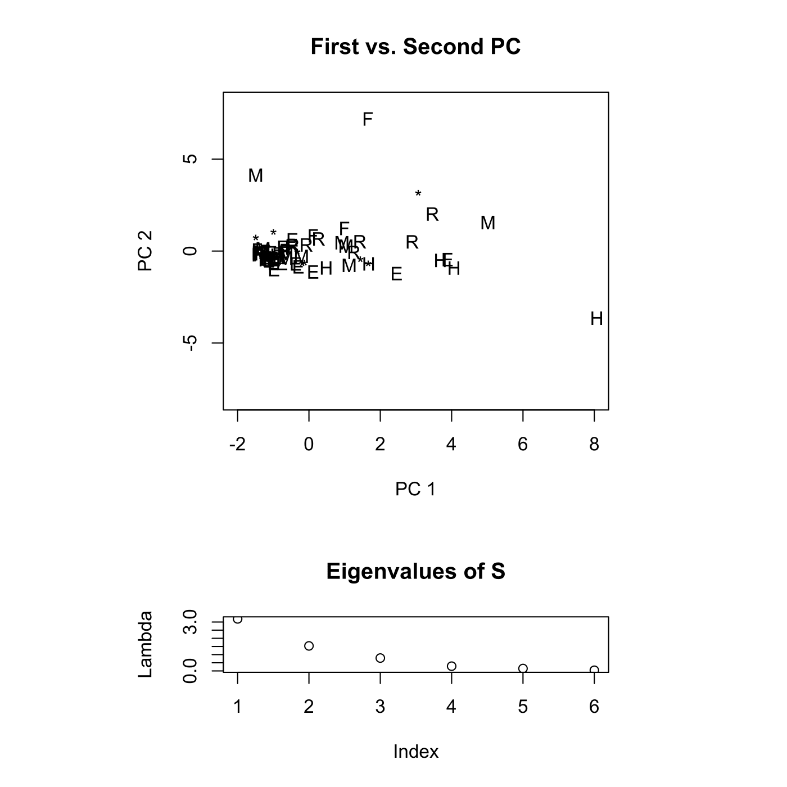
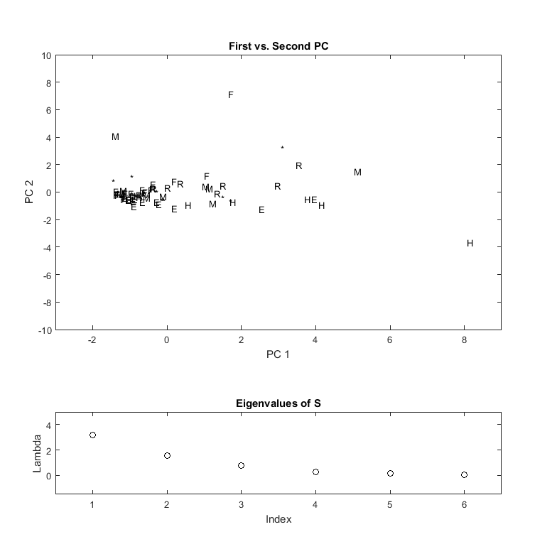
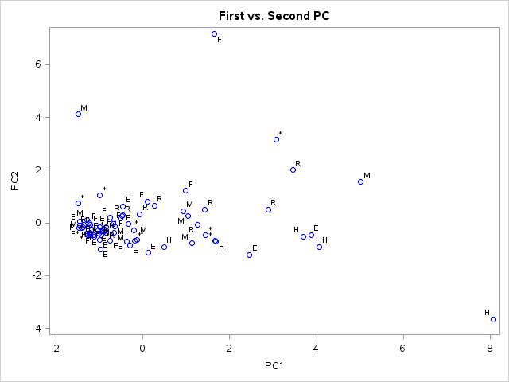
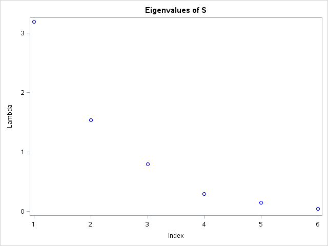

[](http://quantlet.de/)

## [](http://quantlet.de/) **MVAnpcausco2** [](http://quantlet.de/)

```yaml

Name of QuantLet: MVAnpcausco2

Published in: Applied Multivariate Statistical Analysis

Description: Performs a PCA for the standardized US company data without IBM and General Motors. It shows the first two principal components and screeplot of the eigenvalues.

Keywords: principal-components, pca, npca, eigenvalues, standardization, spectral-decomposition, screeplot, plot, graphical representation, data visualization, sas

See also: MVAnpcabanki, MVAnpcabank, MVAnpcahousi, MVAnpcatime, MVAnpcafood, MVAnpcahous, MVAnpcausco, MVAnpcausco2i, MVAcpcaiv, MVApcabank, MVApcabanki, MVApcabankr, MVApcasimu

Author: Zografia Anastasiadou, Awdesch Melzer
Author[SAS]: Svetlana Bykovskaya
Author[Matlab]: Jorge Patron, Vladimir Georgescu, Song Song

Submitted: Fri, April 11 2014 by Awdesch Melzer
Submitted[SAS]: Wed, April 06 2016 by Svetlana Bykovskaya
Submitted[Matlab]: Tue, December 13 2016 by Piedad Castro

Datafile: uscomp2.dat

Note: 'Matlab and SAS decompose matrices differently than R, and therefore some 
      of the eigenvectors may have different signs.'

```









### MATLAB Code
```matlab

%% clear all variables and console and close windows
clear
clc
close all

%% load data
formatSpec = '%s%f%f%f%f%f%f%s';
data       = readtable('uscomp2.dat','Delimiter',' ', 'Format',formatSpec);

%% symbols for the sectors
data.Properties.VariableNames{'Var8'} = 'Sector';
data.Sector = categorical(data.Sector);
data.Sector = mergecats(data.Sector, {'Communication','HiTech'},'H');
data.Sector = renamecats(data.Sector,{'Energy','Finance',...
              'Manufacturing','Retail'},{'E','F','M','R'});
data.Sector = mergecats(data.Sector, {'Medical','Other',...
              'Transportation'}, '*');   
data.Sector = char(data.Sector);          

%% omit the observations for IBM and General Electric
data.Var1 = nominal(data.Var1);
data      = data(data.Var1~='IBM',:);
data      = data(data.Var1~='GeneralElectric',:);

x        = data;
x.Var1   = [];
x.Sector = [];
x        = table2array(x);

[n,p] = size(x);
m     = mean(x);
x     = (x-repmat(m,n,1)).*repmat(1./sqrt((n-1)*var(x)/n),n,1); % standardizes the data matrix
[v,e] = eigs((n-1)*cov(x)/n,p,'la'); % eigenvalues sorted by size from largest to smallest(Note: Command generates a Warning(Disregard it)) 
e1    = diag(e);                     % creates a vector of eigenvalues
x     = x*v;

%% plots
%Eigenvalues
subplot(2,1,2)
subplot('Position',[0.1 0.1 0.8 0.15])
nr=1:6;
scatter(nr,e1,'k')
xlabel('Index')
ylabel('Lambda')
title('Eigenvalues of S')
xlim([0.5 6.5])
ylim([-1.5 5])
box on

%First vs Second PC
subplot(2,1,1)
subplot('Position',[0.1 0.4 0.8 0.5])
title('First vs. Second PC')
xlabel('PC 1')
ylabel('PC 2')
xlim([-3 9])
ylim([-10 10])
hold on
text(x(:,1),x(:,2),data.Sector);
box on
```

automatically created on 2018-05-28

### R Code
```r


# clear all variables
rm(list = ls(all = TRUE))
graphics.off()

# Load data
x = read.table("uscomp2.dat")

# Without IBM and General Electric
x = rbind(x[1:37, ], x[39, ], x[41:79, ])

colnames(x) = c("Company", "A", "S", "MV", "P", "CF", "E", "Sector")
attach(x)
Sector = as.character(Sector)
Sector[1:2]   = "H"
Sector[3:17]  = "E"
Sector[18:34] = "F"
Sector[35:40] = "H"
Sector[41:50] = "M"
Sector[51:61] = "*"
Sector[62:71] = "R"
Sector[72:77] = "*"

x   = x[, 2:7]
n   = nrow(x)
x   = (x - matrix(apply(x, 2, mean), n, 6, byrow = T))/matrix(sqrt((n - 1) * apply(x, 
    2, var)/n), n, 6, byrow = T)  # standardizes the data
eig = eigen((n - 1) * cov(x)/n)   # spectral decomposition
e   = eig$values
v   = eig$vectors
x   = as.matrix(x) %*% v          # principal components
layout(matrix(c(2, 1), 2, 1, byrow = T), c(2, 1), c(2, 1), T)

# plot
plot(e, xlab = "Index", ylab = "Lambda", main = "Eigenvalues of S")
plot(-x[, 1], x[, 2], xlim = c(-2, 8), ylim = c(-8, 8), type = "n", xlab = "PC 1", 
    ylab = "PC 2", main = "First vs. Second PC")
text(-x[, 1], x[, 2], Sector) 

```

automatically created on 2018-05-28

### SAS Code
```sas


* Import the data;
data uscomp2;
  infile '/folders/myfolders/data/uscomp2.dat';
  input Company $ A $ S $ MV $ P $ CF $ E $ Sector $;
run;

proc iml;
  * Read data into a matrix;
  use uscomp2;
    read all var _ALL_ into x[colname = varNames]; 
  close uscomp2;
  
  * Without IBM and General Electric;
  x = x[1:37, ] // x[39, ] // x[41:79, ];
  x[1:2,   "Sector"] = "H";
  x[3:17,  "Sector"] = "E";
  x[18:34, "Sector"] = "F";
  x[35:40, "Sector"] = "H";
  x[41:50, "Sector"] = "M";
  x[51:61, "Sector"] = "*";
  x[62:71, "Sector"] = "R";
  x[72:77, "Sector"] = "*";
  
  y  = num(x[, 2:7]);
  n  = nrow(y); 
  y  = (y - repeat(y(|:,|), n, 1)) / sqrt((n - 1) * var(y) / n); * standardizes the data;
  e  = (n - 1) * cov(y) / n; * spectral decomposition;
  e1 = 1:6;
  e2 = eigval(e);
  v  = eigvec(e); 
  y  = y * v;                * principal components;
  
  x1 = y[,1];
  x2 = y[,2];
  sector = x[,"Sector"];
  create plot var {"x1" "x2" "sector" "e1" "e2"};
    append;
  close plot;
quit;

proc sgplot data = plot
    noautolegend;
  title 'First vs. Second PC';
  scatter x = x1 y = x2 / datalabel = sector 
    markerattrs = (color = blue);
  xaxis label = 'PC1';
  yaxis label = 'PC2';
run;

proc sgplot data = plot
    noautolegend;
  title 'Eigenvalues of S';
  scatter x = e1 y = e2 / markerattrs = (color = blue);
  xaxis label = 'Index';
  yaxis label = 'Lambda';
run;


```

automatically created on 2018-05-28