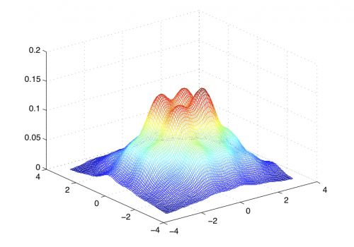
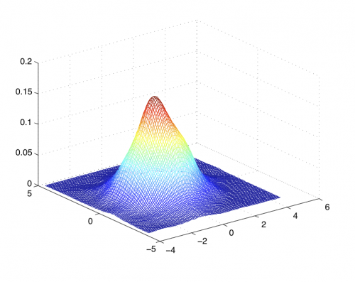

[](http://quantlet.de/)

## [](http://quantlet.de/) **MVAcltbern2** [](http://quantlet.de/)

```yaml

Name of QuantLet: MVAcltbern2

Published in: Applied Multivariate Statistical Analysis

Description: Illustrates the 2D Central Limit Theorem (CLT). n*2000 sets of n-dimensional Bernoulli samples are generated and used to approximate the distribution of t = sqrt(n)*(mean(x)-mu)/sigma -> N(0,1). The estimated joint density is shown.

Keywords: plot, graphical representation, bernoulli, normal, CLT, density, distribution, standard-normal, asymptotic

See also: MVAgausscauchy, MVAcltbern, MVAcauchy, MVAtdis

Author: Wolfgang K. Haerdle

Submitted: Wed, August 03 2011 by Awdesch Melzer
Submitted[Matlab]: Wed, November 23 2016 by Lily Medina

Example: 
- 1: n=5
- 2: n=85

```






### MATLAB Code
```matlab

%% Clear loaded variables and close graphic windows
clear all
close all
clc

%% set parameters
p = 0.5;
n = 85;

bsample = binornd(1,0.5,n,2000);          %Random generation of the binomial distribution with parameters 2000*n and 0.5

bsamplem    = (mean(bsample) - p)/sqrt(p*(1-p)/n);
bsamplemstd = [bsamplem(1:1000);bsamplem(1001:2000)]';

h = 1.06*[std(bsamplemstd(:,1)) std(bsamplemstd(:,2))].* 200.^(-1/5);

%% compute Kernel density
[f1,xi1]  = ksdensity(bsamplemstd(:,1));
[f2,xi2]  = ksdensity(bsamplemstd(:,2));
[xxi,yyi] = meshgrid(xi1,xi2);

xrange = min(bsamplemstd(:,1)):(max(bsamplemstd(:,1))-min(bsamplemstd(:,1)))./99:max(bsamplemstd(:,1));
yrange = min(bsamplemstd(:,2)):(max(bsamplemstd(:,2))-min(bsamplemstd(:,2)))./99:max(bsamplemstd(:,2));

endx  = length(xrange);
endy  = length(yrange);
ndata = length(bsamplemstd(:,1));

for xxxi = 1:endx
    for yyyi = 1:endy
        u1 = (xrange(xxxi)-bsamplemstd(:,1))/h(1);
        u2 = (yrange(yyyi)-bsamplemstd(:,2))/h(2);
        u  = [u1,u2]';
        for is = 1:ndata
            KD(is) = 1/(2*pi)^(2/2)*exp(-1/2*u(:,is)'*u(:,is));
        end
        fhat(xxxi,yyyi) = mean(KD)/prod(h);
    end
end
%% plot
mesh(yyi,xxi,fhat)

```

automatically created on 2018-05-28

### R Code
```r


# clear all variables
rm(list = ls(all = TRUE))
graphics.off()

# install and load packages
libraries = c("KernSmooth")
lapply(libraries, function(x) if (!(x %in% installed.packages())) {
    install.packages(x)
})
lapply(libraries, library, quietly = TRUE, character.only = TRUE)

p = 0.5
n = 5
bsample     = rbinom(n * 2000, 1, 0.5)      # Random generation of the binomial distribution with parameters 2000*n and 0.5
bsamplem    = matrix(bsample, n, 2000)      # Create a matrix of binomial random variables
bsamplemstd = matrix((colMeans(bsamplem) - p)/sqrt(p * (1 - p)/n), 1000, 2)

dj = bkde2D(bsamplemstd, bandwidth = 1.06 * c(sd(bsamplemstd[, 1]), sd(bsamplemstd[, 
    2])) * 200^(-1/5))                      # Compute 2 dimensional kernel density estimate

persp(dj$x1, dj$x2, dj$fhat, box = FALSE, theta = 265, phi = 15, r = sqrt(3), d = 1, 
    ltheta = -135, lphi = 0, shade = NA) 
title(paste("Estimated two-dimensional density, n =",n ))

```

automatically created on 2018-05-28