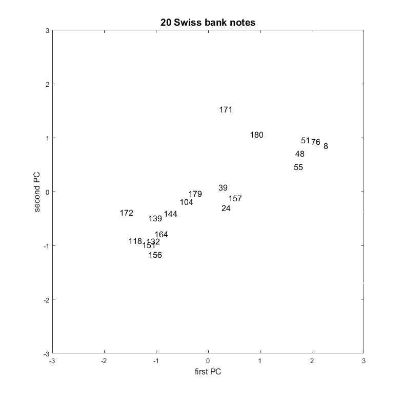
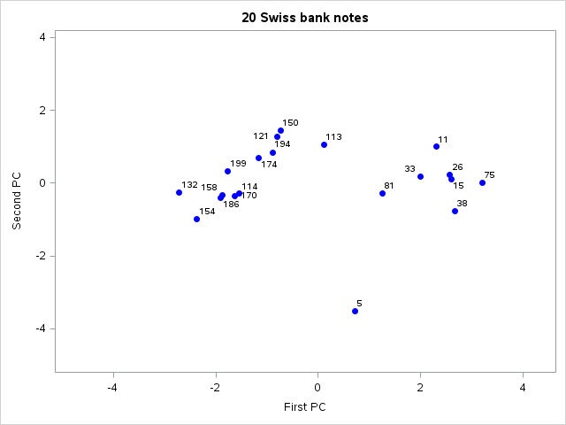
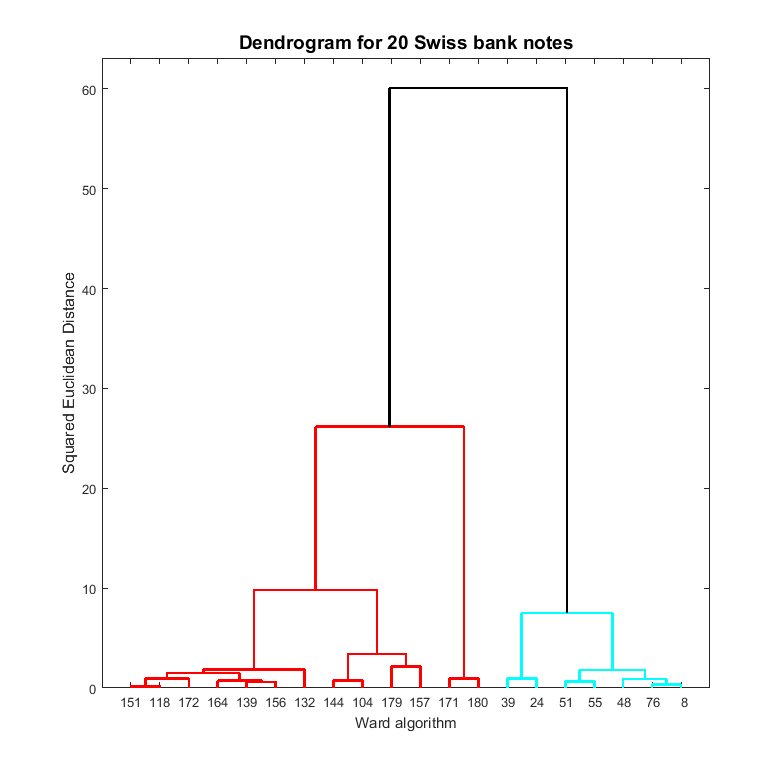
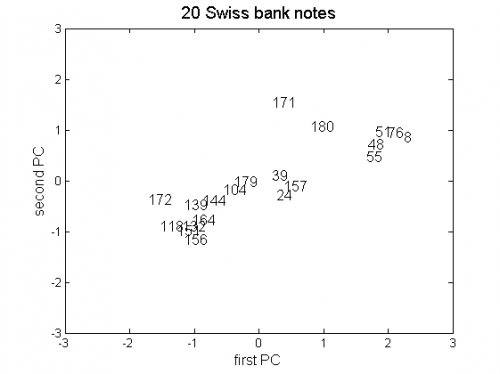
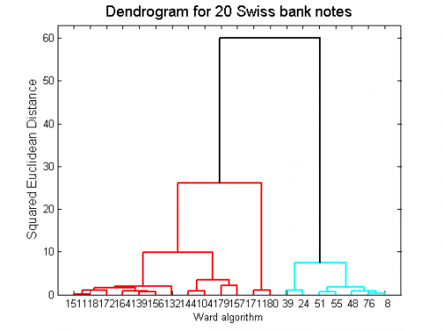
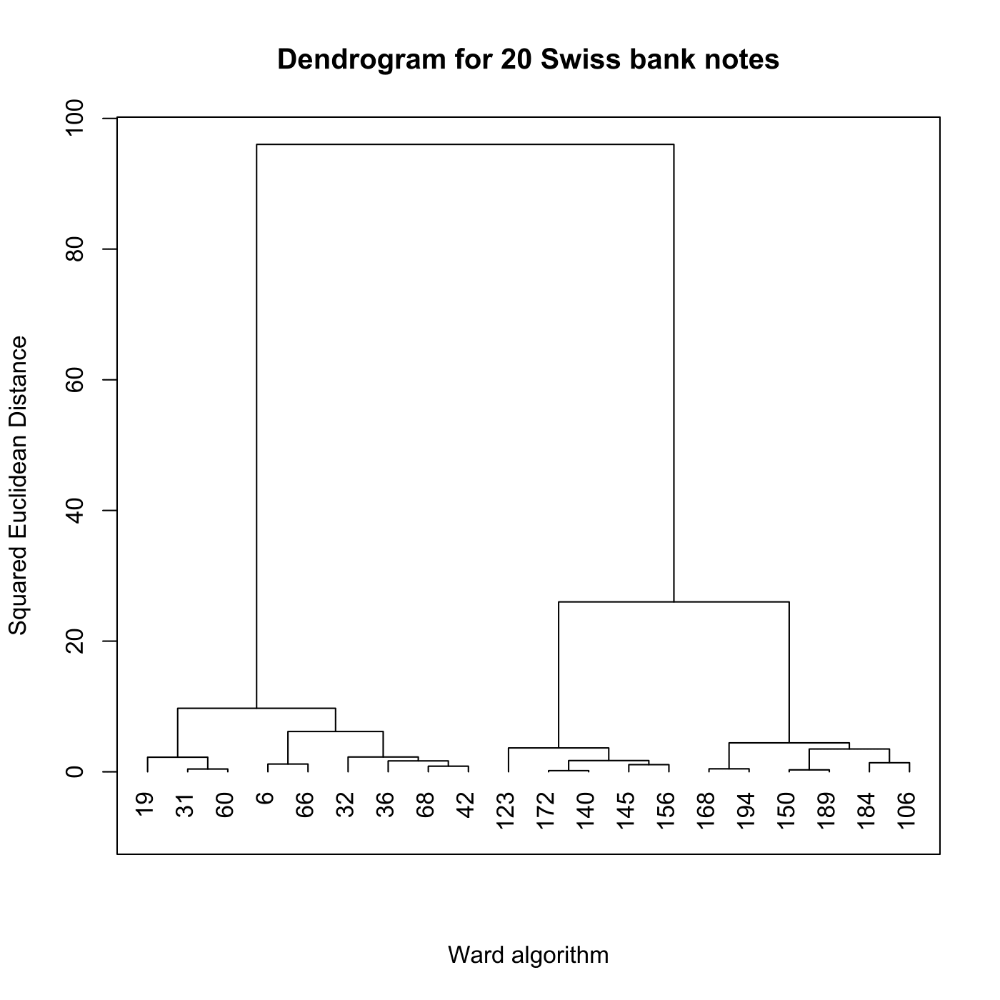

[](http://quantlet.de/)

## [](http://quantlet.de/) **MVAclusbank** [](http://quantlet.de/)

```yaml

Name of QuantLet: MVAclusbank

Published in: Applied Multivariate Statistical Analysis

Description: Performs a PCA and a cluster analysis for 20 randomly chosen bank notes from the swiss bank notes dataset.

Keywords: cluster-analysis, plot, graphical representation, distance, euclidean, data visualization, dendrogram, principal-components, pca, sas

See also: MVAclus8p, MVAclusfood, MVAspecclust, MVAclusbh, MVAclususcrime, SMSclus8p, SMSclus8pd, SMSclus8pmst2, SMSclusbank, SMScluscomp, SMScluscrime, SMScluscrimechi2, SMSclushealth

Author: Zografia Anastasiadou, Simon Trimborn
Author[SAS]: Svetlana Bykovskaya

Submitted: Thu, August 21 2014 by Petra Burdejova
Submitted[SAS]: Wen, April 6 2016 by Svetlana Bykovskaya

Datafile: bank2.dat

Example : 
- 1: PCA for 20 randomly chosen bank notes. 
- 2: The dendrogram for the 20 bank notes after applying the Ward algorithm.
- 3: PCA with clusters

```
















### MATLAB Code
```matlab

% ------------------------------------------------------------------------------
% Book:         MVA
% ------------------------------------------------------------------------------
% Quantlet:     MVAclusbank
% ------------------------------------------------------------------------------
% Description:  MVAclusbank performs a PCA and a cluster analysis for 20 randomly
%               chosen bank notes from the swiss bank notes dataset (bank2.dat).
% ------------------------------------------------------------------------------
% Usage:        -
% ------------------------------------------------------------------------------
% Inputs:       None
% ------------------------------------------------------------------------------
% Output:       PCA for the 20 randomly chosen bank notes from bank2.dat and 
%               the Dendrogram of them after applying the Ward algorithm.
% ------------------------------------------------------------------------------
% Example:      -
% ------------------------------------------------------------------------------
% Author:       Zografia Anastasiadou 20100504; Matlab: Awdesch Melzer
%               20120329
% ------------------------------------------------------------------------------

% clear variables and close graphics
clear all
close all
clc

% load data set
data = load('bank2.dat');
names = 1:length(data);

data = [names', data];

rng = RandStream.getGlobalStream;
rng.reset(20)
% sample of 20 randomly chosen bank notes from data

xx = data(randsample(length(data),20),:);
xx1 = xx(:,1)
xx = xx(:,2:7)
% PCA
mu = mean(xx);

m = repmat(mu,20,1);

x = xx-m;
% spectral decomposition
[eve,eva] = eig(cov(x));  
xm = x;
y = xm*eve';
% first two eigenvectors      
ym = y(:,1:2);

% plot PCA
figure(1)
hold on
plot(ym,'w')
xlabel('first PC','FontSize',12)
ylabel('second PC','FontSize',12)
xlim([-3,3])
ylim([-3,3])
title('20 Swiss bank notes', 'FontSize',14)
s = int2str(xx1);
text(ym(:,1),ym(:,2),s,'FontSize',12)
box on
hold off

% euclidean distance matrix
d = pdist(xx,'euclidean');
% squared euclidean distance matrix
dd = d.^2;
% cluster analysis with ward algorithm
w = linkage(dd,'ward');

% Dendrogram for the 20 bank notes after Ward algorithm
figure(2)
[H,T] = dendrogram(w,'colorthreshold','default','labels',s);
set(H,'LineWidth',2)
title('Dendrogram for 20 Swiss bank notes','FontSize',14)
ylabel('Squared Euclidean Distance','FontSize',12)
xlabel('Ward algorithm')
box on

```

automatically created on 2018-05-28

### R Code
```r


# clear all variables
rm(list = ls(all = TRUE))
graphics.off()

# install and load packages
libraries = c("car")
lapply(libraries, function(x) if (!(x %in% installed.packages())) {
    install.packages(x)
})
lapply(libraries, library, quietly = TRUE, character.only = TRUE)

# load data
data = read.table("bank2.dat")
xx   = data[sample(1:nrow(data), 20, replace = F), ]  # sample of 20 randomly chosen bank notes from data  

# PCA
set.seed(3)
mean = as.vector(colMeans(xx))
m    = matrix(mean, nrow(xx), NROW(mean), byrow = T)
x    = xx - m
eig  = eigen(cov(x))  # spectral decomposition  
eva  = eig$values
eve  = eig$vectors
xm   = as.matrix(x)
y    = xm %*% eve
ym   = y[, 1:2]       # first two eigenvectors

# Plot 1: PCA
plot(ym, type = "n", xlab = "first PC", ylab = "second PC", main = "20 Swiss bank notes", 
    ylim = c(-5, 4), xlim = c(-4, 4.5))
text(ym[, 1], ym[, 2], rownames(xx), cex = 1.2)
d  = dist(xx, method = "euclidean", p = 2)  # euclidean distance matrix
dd = d^2                                    # squared euclidean distance matrix                        
w  = hclust(dd, method = "ward.D")          # cluster analysis with ward algorithm

# Plot 2: Dendrogram for the 20 bank notes after applying the Ward algorithm
dev.new()
plot(w, hang = -0.1, frame.plot = TRUE, ann = FALSE)
title(main = "Dendrogram for 20 Swiss bank notes", ylab = "Squared Euclidean Distance", 
    xlab = "Ward algorithm")

# Plot 3: PCA with clusters
dev.new()
groups = cutree(w, h = 60)
merg   = matrix(c(ym, as.matrix(groups)), nrow = 20, ncol = 3)
merg   = merg[sort.list(merg[, 3]), ]
merg1  = merg[1:11, 1:2]
merg2  = merg[12:20, 1:2]
plot(ym, type = "n", xlab = "first PC", ylab = "second PC", main = "20 Swiss bank notes, cut height 60", 
    ylim = c(-5, 4), xlim = c(-4, 4.5))
text(ym[, 1], ym[, 2], rownames(xx), cex = 1.2)
dataEllipse(x = merg1[, 1], y = merg1[, 2], center.pch = 0, col = "red", plot.points = F, 
    add = T, levels = 0.95)
dataEllipse(x = merg2[, 1], y = merg2[, 2], center.pch = 0, col = "blue", plot.points = F, 
    add = T, levels = 0.9) 

```

automatically created on 2018-05-28

### SAS Code
```sas


* Import the data;
data b2;
  count + 1;
  infile '/folders/myfolders/data/bank2.dat';
  input t1-t6;
run;

* sample of 20 randomly chosen bank notes from data;
proc surveyselect data = b2 method = SRS 
  sampsize = 20 out = bank2 noprint;
  id _all_;
run;

proc iml;
  * Read data into a matrix;
  use bank2;
    read all var _ALL_ into xx; 
  close bank2;
  
  num = xx[,1];
  xx = xx[,2:7];
  
  * PCA;
  x = xx - repeat(xx(|:,|), nrow(xx), 1);
  e  = cov(x);         * spectral decomposition;
  eva = eigval(e);
  eve = eigvec(e);
  y = (x * eve)[, 1:2]; * first two eigenvectors;
  
  x1 = y[,1];
  x2 = -y[,2];
  
  create plot var {"x1" "x2" "num"};
    append;
  close plot;
quit;

* Plot 1: PCA;
proc sgplot data = plot    
    noautolegend;
  title '20 Swiss bank notes';
  scatter x = x1 y = x2 / markerattrs = (color = blue symbol = circlefilled)
    datalabel = num;
  xaxis min = -5 max = 4.5 label = 'First PC';
  yaxis min = -5 max = 4 label = 'Second PC';
run;

* Plot 2: Dendrogram for the 20 bank notes after applying the Ward algorithm;
proc distance data = bank2 out = dist method = euclid nostd;
  var interval(t1 t2 t3 t4 t5 t6);
run;

data newdist;
  set dist;
  set plot;
  drop x1 x2;
run;

ods graphics on;
proc cluster data = newdist(type = distance)
    method = ward 
    plots(only) = (Pseudo Dendrogram(vertical))
    print = 0
    outtree = stat;
  id num;
  title 'Ward Dendrogram for 20 Swiss bank notes';
run;
ods graphics off;

* Plot 3: PCA with clusters;
proc tree data = stat noprint out = sol level= 0.4;
  id num;
run;

proc sort data = sol;
  by num;
run;

proc sort data = plot;
  by num;
run;

data plot2;
  set plot;
  set sol;
run;

proc sgplot data = plot2
    noautolegend;
  title '20 Swiss bank notes, cut height 60';
  scatter x = x1 y = x2 / colorresponse = CLUSTER colormodel = (red blue)
    markerattrs = (symbol = circlefilled)
    datalabel = num;
  xaxis min = -5 max = 4.5 label = 'First PC';
  yaxis min = -5 max = 4 label = 'Second PC';
run;
```

automatically created on 2018-05-28