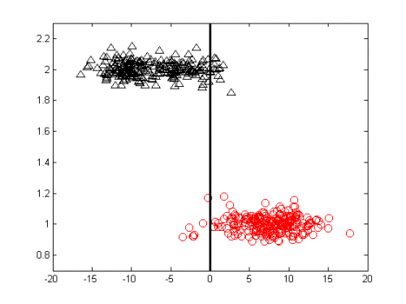
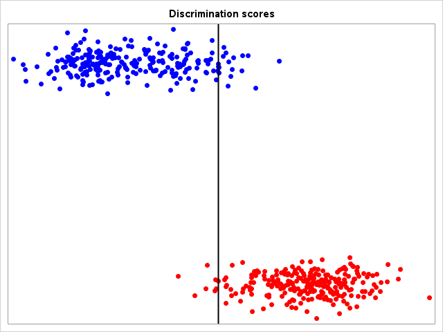

[](http://quantlet.de/)

## [](http://quantlet.de/) **MVAdiscbh** [](http://quantlet.de/)

```yaml

Name of QuantLet: MVAdiscbh

Published in: Applied Multivariate Statistical Analysis

Description: Demonstrates maximum likelihood discrimination rule (ML rule) for the Boston housing data.

Keywords: apparent-error-rate, discrimination, cluster-analysis, estimation, discriminant-analysis, euclidean-distance-matrix, maximum-likelihood, plot, graphical representation, financial, sas

See also: MVAaer, MVAaper, MVAaerbh, MVAdisfbank, MVAdisnorm

Author: Zografia Anastasiadou
Author[SAS]: Svetlana Bykovskaya

Submitted: Thu, August 04 2011 by Awdesch Melzer
Submitted[SAS]: Wen, April 6 2016 by Svetlana Bykovskaya

Datafile: bostonh.dat

Example: Discrimination scores for the two clusters created from the Boston housing data.

```






### MATLAB Code
```matlab

% ------------------------------------------------------------------------------
% Book:         MVA
% ------------------------------------------------------------------------------
% Quantlet:     MVAdiscbh
% ------------------------------------------------------------------------------
% Description:  MVAdiscbh demonstrates the maximum likelihood (ML) discrimination 
%               rule for the Boston housing data (bostonh.dat).
% ------------------------------------------------------------------------------
% Usage:        hclust
% ------------------------------------------------------------------------------
% Inputs:       None      
% ------------------------------------------------------------------------------
% Output:       Application of the linear discriminant rule on the variables of 
%               the transformed bostonh.dat, calculation of the APER (apparent 
%               error rate) for price and clusters of Boston houses and plot of 
%               the linear discriminant scores for the two clusters created from
%               the transformed bostonh.dat.
% ------------------------------------------------------------------------------
% Example:      -
% ------------------------------------------------------------------------------
% Author:       Zografia Anastasiadou 20100924
%               Matlab: Awdesch Melzer 20120407
% ------------------------------------------------------------------------------

% clear loaded variables and close windows
clear all;
close all;
clc;

% load data
data = load('bostonh.dat');

%transform data
xt = data;
xt(:,1) = log(data(:,1));
xt(:,2) = data(:,2)./10;
xt(:,3) = log(data(:,3));
xt(:,5) = log(data(:,5));
xt(:,6) = log(data(:,6));
xt(:,7) = (data(:,7).^(2.5))./10000;
xt(:,8) = log(data(:,8));
xt(:,9) = log(data(:,9));
xt(:,10) = log(data(:,10));
xt(:,11) = exp(0.4*data(:,11))./1000;
xt(:,12) = data(:,12)./100;
xt(:,13) = sqrt(data(:,13));
xt(:,14) = log(data(:,14));
data = xt;
data(:,4) = [];

%standardize variables
[n m] = size(data);
for i = 1:n
da(i,:) = (data(i,:)-mean(data))./sqrt((n-1)*var(data)/n);
end

%euclidean distance matrix
d = pdist(da,'euclidean',2);

%cluster analysis with ward algorithm                                          
w = hclust(d);

%define the clusters, tree=1 if cluster=1
tree = cluster(w,'maxclust',2);

t1 = da(find(tree==1),:);

t2 = da(find(tree==2),:);

%mean of first cluster
m1 = mean(t1);
%mean of second cluster
m2 = mean(t2);
%mean of both clusters
m = (m1+m2)/2;

%common variance matrix
s = ((length(t1)-1)*cov(t1)+(length(t2)-1)*cov(t2))/(length(xt)-2);
%alpha for the discrimination rule
alpha = inv(s)*(m1-m2)';

%APER for clusters of Boston houses
mis1 = sum((t1-repmat(m,length(t1),1))*alpha<0) %misclassified 1
mis2 = sum((t2-repmat(m,length(t2),1))*alpha>0) %misclassified 2
corr1 = sum((t1-repmat(m,length(t1),1))*alpha>0) %correct 1
corr2 = sum((t2-repmat(m,length(t2),1))*alpha<0) %correct 2
disp('Apparent error rate for clusters of Boston houses')
aper = (mis1+mis2)./length(xt) %APER (apparent error rate)

alph = (da-repmat(m,length(da),1))*alpha;

%linear discriminant scores
p = [alph,tree+0.05*normrnd(0,1,length(tree),1)];

%plot of the linear discriminant scores
gscatter(p(:,1),p(:,2),tree,'rk','o^',8)
line([0,0],[0.7,2.3],'Color','k','LineWidth',2.4)
ylim([0.7,2.3])
legend off
box on
%%%%%%%%%%%%%%%%%%%%%%%%%%%%%%%%%%%%%%%%%%%%%%%%%%
% Calculation of APER for price of Boston houses.
% Demonstration of the ML discrimination rule and 
% calculation the apparent error rate for Boston housing

for i=1:length(xt)
    if xt(i,14)>median(xt(:,14));
        true(i)=1;
    else
        true(i)=0;
    end
end

j=0;
k=0;
for i=1:length(xt)
    if true(i)==1 
        j=j+1;
        xg0(j,:)=xt(i,:);
    else
        k=k+1;
        xf0(k,:)=xt(i,:);
    end
end
a0=xg0(:,1:3);
b0=xg0(:,5:13);

a1=xf0(:,1:3);
b1=xf0(:,5:13);

xg=[a0,b0];
xf=[a1,b1];

mg=mean(xg);
mf=mean(xf);
m=(mf+mg)/2;

s=((length(xg)-1)*cov(xg)+(length(xf)-1)*cov(xf))/(length(xt)-2);

alpha=inv(s)*(mg-mf)';

miss1=0;
miss2=0;
corr1=0;
corr2=0;

for i=1:length(xg)
    aux1(i)=(xg(i,:)-m)*alpha;
end

for i=1:length(aux1)
    if aux1(i)<0 
        miss1=miss1+1;
    else
        corr1=corr1+1;
    end
end

for i=1:length(xf)
    aux2(i)=(xf(i,:)-m)*alpha;
end

for i=1:length(aux2)
    if aux2(i)>0 
        miss2=miss2+1;
    else
        corr2=corr2+1;
    end
end

disp('Group 1 classified as 2: ')
miss1
disp('Group 2 classified as 1: ')
miss2
disp('Group 1 classified as 1: ')
corr1
disp('Group 2 classified as 2:  ')
corr2
disp('APER (apparent error rate) for price of Boston houses:')
aper=(miss1+miss2)/length(xt);
aper
```

automatically created on 2018-05-28

### R Code
```r


# clear all variables
rm(list = ls(all = TRUE))
graphics.off()

# load data
data = read.table("bostonh.dat")

# transform data
xt        = data
xt[, 1]   = log(data[, 1])
xt[, 2]   = data[, 2]/10
xt[, 3]   = log(data[, 3])
xt[, 5]   = log(data[, 5])
xt[, 6]   = log(data[, 6])
xt[, 7]   = (data[, 7]^(2.5))/10000
xt[, 8]   = log(data[, 8])
xt[, 9]   = log(data[, 9])
xt[, 10]  = log(data[, 10])
xt[, 11]  = exp(0.4 * data[, 11])/1000
xt[, 12]  = data[, 12]/100
xt[, 13]  = sqrt(data[, 13])
xt[, 14]  = log(data[, 14])
data      = xt[, -4]

da    = scale(data)                     # standardize variables
d     = dist(da, "euclidean", p = 2)    # euclidean distance matrix
w     = hclust(d, method = "ward.D")    # cluster analysis with ward algorithm
tree  = cutree(w, 2)                    # define the clusters, tree=1 if cluster=1

# the following two lines under comments are for price of Boston houses
# tree=(xt[,14]>median(xt[,14]))+1 
# da=da[,1:12]

t1  = subset(da, tree == 1)
t2  = subset(da, tree == 2)

m1  = colMeans(t1)                      # mean of first cluster
m2  = colMeans(t2)                      # mean of second cluster
m   = (m1 + m2)/2                       # mean of both clusters
s = ((nrow(t1) - 1) * cov(t1) + (nrow(t2) - 1) * cov(t2))/(nrow(xt) - 2)    # common variance matrix
alpha = solve(s) %*% (m1 - m2)                                              # alpha for the discrimination rule

# APER for clusters of Boston houses
mis1  = sum((t1 - m) %*% alpha < 0)     # misclassified 1
mis2  = sum((t2 - m) %*% alpha > 0)     # misclassified 2
corr1 = sum((t1 - m) %*% alpha > 0)     # correct 1
corr2 = sum((t2 - m) %*% alpha < 0)     # correct 2
aper  = (mis1 + mis2)/nrow(xt)          # APER (apparent error rate)
alph  = (da - matrix(m, nrow(da), ncol(da), byrow = T)) %*% alpha
set.seed(1)

# discrimination scores
p = cbind(alph, tree + 0.05 * rnorm(NROW(tree)))
tree[tree == 1] = 16
tree[tree == 2] = 17
tr = tree
tr[tr == 16] = "red"
tr[tr == 17] = "black"

# plot of discrimination scores
plot(p[, 1], p[, 2], pch = tree, col = tr, xaxt = "n", yaxt = "n", xlab = "", ylab = "", 
    bty = "n")
abline(v = 0, lwd = 3) 
title(paste("Discrimination scores"))

```

automatically created on 2018-05-28

### SAS Code
```sas

* Import the data;
data bostonh;
  infile '/folders/myfolders/data/bostonh.dat';
  input temp1-temp14;
run;

proc iml;
  * Read data into a matrix;
  use bostonh;
    read all var _ALL_ into datax; 
  close bostonh;
  
  xt = datax;
  xt[, 1]  = log(datax[, 1]);
  xt[, 2]  = datax[, 2]/10;
  xt[, 3]  = log(datax[, 3]);
  xt[, 5]  = log(datax[, 5]);
  xt[, 6]  = log(datax[, 6]);
  xt[, 7]  = (datax[, 7] ## (2.5))/10000;
  xt[, 8]  = log(datax[, 8]);
  xt[, 9]  = log(datax[, 9]);
  xt[, 10] = log(datax[, 10]);
  xt[, 11] = exp(0.4 * datax[, 11])/1000;
  xt[, 12] = datax[, 12]/100;
  xt[, 13] = sqrt(datax[, 13]);
  xt[, 14] = log(datax[, 14]);
  datax = xt[,1:3] || xt[,5:14];
  
  create dat from datax[colname={"t1" "t2" "t3" "t4" "t5" "t6" "t7" "t8" "t9" "t10" "t11" "t12" "t13"}];
    append from datax;
  close dat;
  
  create dat2 from xt[colname={"t1" "t2" "t3" "t4" "t5" "t6" "t7" "t8" "t9" "t10" "t11" "t12" "t13" "t14"}];
    append from xt;
  close dat2;

quit;

* standardize the data matrix;
proc standard data = dat mean = 0 std = 1 out = ydat;
  var t1-t13;
run;

* euclidean distance matrix;
proc distance data = ydat out = dist method = euclid nostd;
  var interval (t1--t13);
run;

data newdist;
  id + 1;
  set dist;
run;

* cluster analysis with ward algorithm;
ods graphics on;
proc cluster data = newdist(type = distance)
    method = ward 
    plots(only) = (Pseudo Dendrogram(vertical))
    print = 0
    outtree = stat 
    noprint;
  id id;
  title 'Ward Dendrogram for standardized data';
run;
ods graphics off;

* define the clusters;
proc tree data = stat noprint out = sol nclusters = 2;
  id id;
run;

data t3;
  set sol;
  if CLUSTER = 1;
run;

data t4;
  set sol;
  if CLUSTER = 2;
run;

data ydat2;
  id + 1;
  set ydat;
run;

proc iml;
  * all data;
  use ydat2;
    read all var _ALL_ into main; 
  close ydat2;
  
  * cluster 1;
  use t3;
    read all var _ALL_ into r3; 
  close t3;
  
  * cluster 2;
  use t4;
    read all var _ALL_ into r4; 
  close t4;
  
  * original data;
  use dat2;
    read all var _ALL_ into z; 
  close dat2;
  
  idd1 = r3[,1];
  idd2 = r4[,1];
  
  main = main[,2:14];
  d1 = main[idd1,];
  d2 = main[idd2,];
  
  m1 = (d1[:,]);                      * mean of first cluster;
  m2 = (d2[:,]);                      * mean of second cluster;
  m  = (m1 + m2) / 2;                 * mean of both clusters;
  s  = ((nrow(d1) - 1) * cov(d1) + (nrow(d2) - 1) * cov(d2))/(nrow(z) - 2);    * common variance matrix;
  alpha = inv(s) * (m1 - m2)`;        * alpha for the discrimination rule;
  
  * APER for clusters of Boston houses;
  mis1  = sum((d1 - m) * alpha < 0);  * misclassified 1;
  mis2  = sum((d2 - m) * alpha > 0);  * misclassified 2;
  corr1 = sum((d1 - m) * alpha > 0);  * correct 1;
  corr2 = sum((d2 - m) * alpha < 0);  * correct 2;
  aper  = (mis1 + mis2)/nrow(z);      * APER (apparent error rate);
  alph  = (main - repeat(m, nrow(main), 1)) * alpha;
  
  n = nrow(z);
  z = (1:n)` || z;
  
    * marker for cluster 1;
  do i = 1 to nrow(idd1);
    z[idd1[i],1] = 1;
  end;
  
  * marker for cluster 2;
  do i = 1 to nrow(idd2);
    z[idd2[i],1] = 2;
  end;
  
  * discrimination scores;
  t = 0.05 * randnormal(n, 0, 1);
  do i = 1 to n;
    t[i] = z[i,1] + t[i];
  end;

  p = z[,1] || alph || t;
  
  id = p[,1];
  x1 = p[,2];
  x2 = p[,3];

  create plot var {"x1" "x2" "id"};
    append;
  close plot;
quit;

proc sgplot data = plot
    noautolegend;
  title 'Discrimination scores';
  scatter x = x1 y = x2 / colorresponse = id colormodel = (red blue)
    markerattrs = (symbol = circlefilled);
  refline 0 / axis = x lineattrs = (color = black thickness = 2);
  xaxis display = none;
  yaxis display = none;
run;


```

automatically created on 2018-05-28