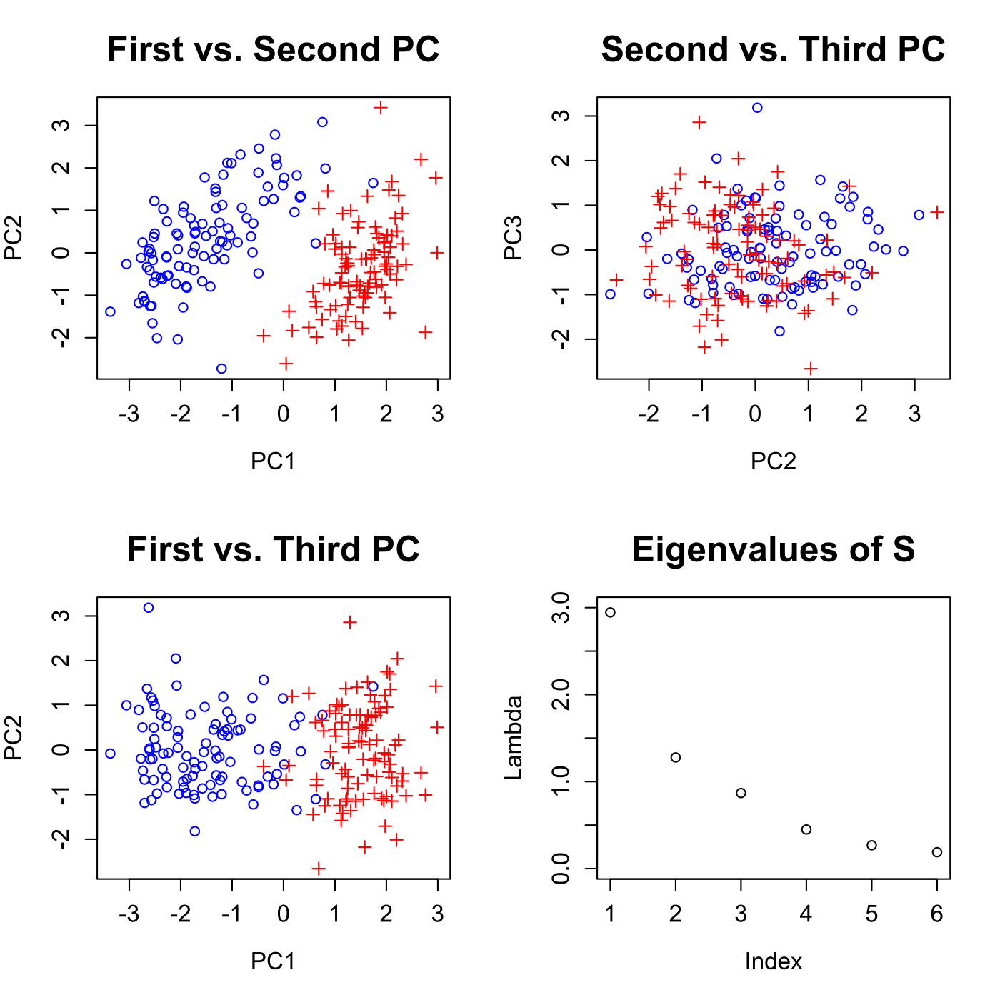
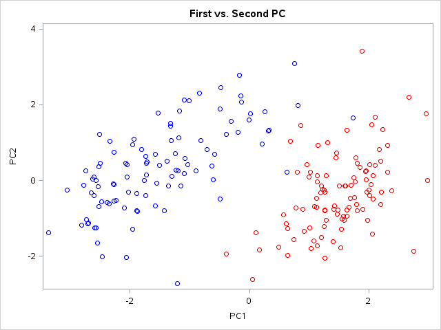
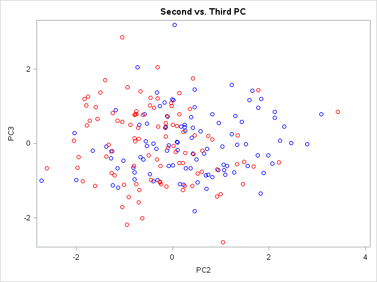
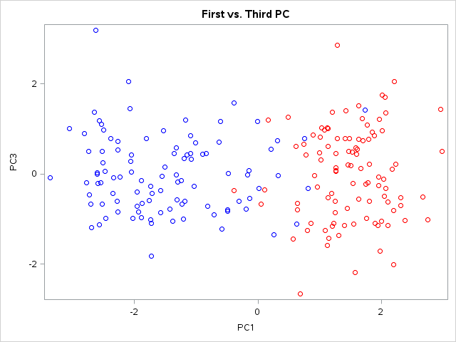
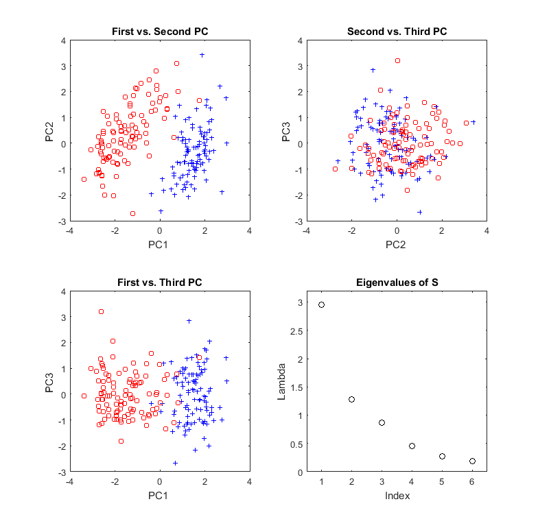

[](http://quantlet.de/)

## [](http://quantlet.de/) **MVAnpcabank** [](http://quantlet.de/)

```yaml

Name of QuantLet: MVAnpcabank

Published in: Applied Multivariate Statistical Analysis

Description: Performs a PCA for the standardized Swiss bank notes and shows the first three principal components in two-dimensional scatterplots. Additionally, a screeplot of the eigenvalues is displayed.

Keywords: principal-components, pca, npca, eigenvalues, standardization, scatterplot, screeplot, plot, graphical representation, data visualization, sas

See also: MVAnpcabanki, MVAnpcahous, MVAnpcahousi, MVAnpcatime, MVAnpcafood, MVAnpcausco, MVAnpcausco2, MVAnpcausco2i, MVAcpcaiv, MVApcabank, MVApcabanki, MVApcabankr, MVApcasimu

Author: Zografia Anastasiadou
Author[SAS]: Svetlana Bykovskaya
Author[Matlab]: Jorge Patron, Vladimir Georgescu, Song Song

Submitted: Thu, August 04 2011 by Awdesch Melzer
Submitted[SAS]: Wed, April 06 2016 by Svetlana Bykovskaya
Submitted[Matlab]: Tue, December 13 2016 by Piedad Castro

Datafile: bank2.dat

Note: 'Matlab and SAS decompose matrices differently than R, and therefore some 
      of the eigenvectors may have different signs.'

```












### MATLAB Code
```matlab

%% clear all variables and console and close windows
clear
clc
close all

%% load data
x = load('bank2.dat');

% Vector with ones in the first 100 entries and zeros in the rest
% that enables us to use the 'gscatter'command to plot the data in groups.
groups = vertcat(ones(100,1),zeros(100,1));   

[n,p] = size(x);
m     = mean(x);
x     = (x-repmat(m,n,1)).*repmat(1./sqrt(var(x)),n,1);    % standardizes the data matrix
[v,e] = eigs(cov(x),p,'la');      % eigenvalues sorted by size from largest to smallest(Note: Command generates a Warning(Disregard it)) 
e1    = diag(e);                  % Creates column vector of eigenvalues

% change the signs of some eigenvector. This is done only to make easier
% the comparison with R results.
v(:,[1,5,6]) = -v(:,[1,5,6]);

x = x*v;    % data multiplied by eigenvectors

%% plot
%% plot, eigenvalues
nr = 1:6;
subplot(2,2,4)
scatter(nr,e1,'k')
xlabel('Index')
ylabel('Lambda')
title('Eigenvalues of S')
xlim([0.5 6.5])
ylim([0 3.2])
box on
%% plot of the first vs. second PC
subplot(2,2,1)
gscatter(x(:,1),x(:,2),groups,'br','+o',5,'off')  
xlabel('PC1 ')
ylabel('PC2 ')
title('First vs. Second PC')
%% plot of the second vs. third PC
subplot(2,2,2)
gscatter(x(:,2),x(:,3),groups,'br','+o',5,'off')  
xlabel('PC2 ')
ylabel('PC3 ')
title('Second vs. Third PC')
%% plot of the first vs. third PC
subplot(2,2,3)
gscatter(x(:,1),x(:,3),groups,'br','+o',5,'off')   
xlabel('PC1 ')
ylabel('PC3 ')
title('First vs. Third PC')

```

automatically created on 2018-05-28

### R Code
```r


# clear all variables
rm(list = ls(all = TRUE))
graphics.off()

# load data
x  = read.table("bank2.dat")
x  = scale(x)                    # standardizes the data matrix
e  = eigen(cov(x))               # calculates eigenvalues and eigenvectors and sorts them by size
e1 = e$values
x  = as.matrix(x) %*% e$vectors  # data multiplied by eigenvectors

# plot of the first vs. second PC
par(mfrow = c(2, 2))
plot(x[, 1], x[, 2], pch = c(rep(1, 100), rep(3, 100)), col = c(rep("blue", 100), 
    rep("red", 100)), xlab = "PC1", ylab = "PC2", main = "First vs. Second PC", cex.lab = 1.2, 
    cex.axis = 1.2, cex.main = 1.8)

# plot of the second vs. third PC
plot(x[, 2], x[, 3], pch = c(rep(1, 100), rep(3, 100)), col = c(rep("blue", 100), 
    rep("red", 100)), xlab = "PC2", ylab = "PC3", main = "Second vs. Third PC", cex.lab = 1.2, 
    cex.axis = 1.2, cex.main = 1.8)

# plot of the first vs. third PC
plot(x[, 1], x[, 3], pch = c(rep(1, 100), rep(3, 100)), col = c(rep("blue", 100), 
    rep("red", 100)), xlab = "PC1", ylab = "PC2", main = "First vs. Third PC", cex.lab = 1.2, 
    cex.axis = 1.2, cex.main = 1.8)

# plot of the eigenvalues
plot(e1, ylim = c(0, 3), xlab = "Index", ylab = "Lambda", main = "Eigenvalues of S", 
    cex.lab = 1.2, cex.axis = 1.2, cex.main = 1.8) 

```

automatically created on 2018-05-28

### SAS Code
```sas


* Import the data;
data b2;
  infile '/folders/myfolders/Sas-work/data/bank2.dat';
  input x1-x6;
run;

* standardize the data matrix;
proc standard data = b2 mean = 0 std = 1 out = y;
  var x1 x2 x3 x4 x5 x6;
run;

proc iml;
  * Read data into a matrix;
  use y;
    read all var _ALL_ into x; 
  close y;
  
  e2 = eigval(cov(x));
  x  = x * eigvec(cov(x));
  id = (repeat ({1}, 1, 100) || repeat ({2}, 1, 100))`;
  
  x1 = -x[,1];
  x2 = x[,2];
  x3 = x[,3];
  e1 = 1:nrow(e2);
  create plot var {"x1" "x2" "x3" "e1" "e2" "id"};
    append;
  close plot;
quit;

* plot of the first vs. second PC;
proc sgplot data = plot
    noautolegend;
  title 'First vs. Second PC';
  scatter x = x1 y = x2 / colorresponse = id colormodel = (blue red);
  xaxis label = 'PC1';
  yaxis label = 'PC2';
run;

* plot of the second vs. third PC;
proc sgplot data = plot
    noautolegend;
  title 'Second vs. Third PC';
  scatter x = x2 y = x3 / colorresponse = id colormodel = (blue red);
  xaxis label = 'PC2';
  yaxis label = 'PC3';
run;

* plot of the first vs. third PC;
proc sgplot data = plot
    noautolegend;
  title 'First vs. Third PC';
  scatter x = x1 y = x3 / colorresponse = id colormodel = (blue red);
  xaxis label = 'PC1';
  yaxis label = 'PC3';
run;

* plot of the eigenvalues;
proc sgplot data = plot
    noautolegend;
  title 'Eigenvalues of S';
  scatter x = e1 y = e2 / markerattrs = (color = blue);
  xaxis label = 'Index';
  yaxis label = 'Lambda';
run;


   

```

automatically created on 2018-05-28