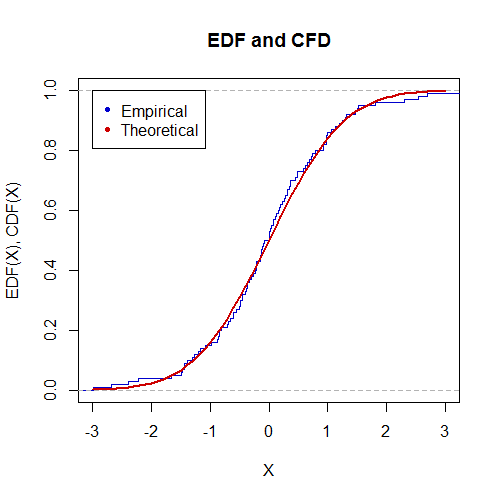
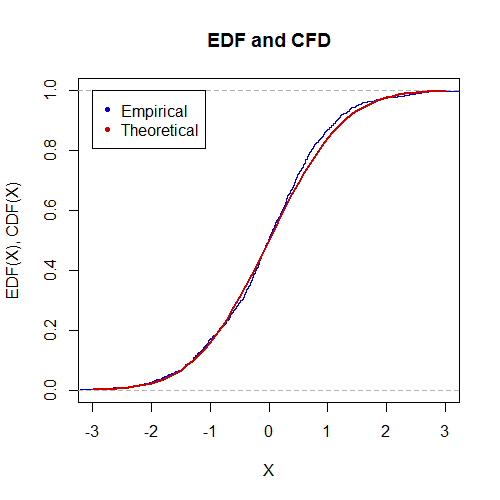

[](http://quantlet.de/index.php?p=info)

## [](http://quantlet.de/) **MVAedfnormal** [](http://quantlet.de/d3/ia)

```yaml

Name of QuantLet : MVAedfnormal

Published in : Applied Multivariate Statistical Analysis

Description : 'Draws n observations from a standard normal distribution and plots its empirical
distribution function (edf) vs. the normal cumulative distribution function (cdf). Number of draws
can be entered interactively.'

Keywords : 'standard-normal, multivariate, plot, graphical representation, edf, cdf, standard,
normal, distribution'

See also : MVAedfbootstrap

Author : Vladimir Georgescu, Jorge Patron, Song Song, Awdesch Melzer

Submitted : Wed, March 14 2012 by Dedy Dwi Prastyo

Example : 'Shows the EDF and CDF for the empirical and theoretical distribution with n=100 and
n=1000.'

```






```r

# close windows and clear variables
graphics.off()
rm(list = ls(all = TRUE))

# input parameters
print("Please input number of draws n as: 100")
print("then press enter two times")
para = scan()

while (length(para) < 1) {
  print("Not enough input arguments. Please input a scalar like 100")
  print(" ")
  print("[n]=")
  para = scan()
}
n = para[1]

if (n <= 1) {
  print("MVAedfnormal: Number of observations must be larger than 0. Please input again. n=")
  n = scan()
}
set.seed(80)

# Generate standard normal random numbers
y = rnorm(n, 0, 1)  
y = ecdf(y)

# Plot of empirical distribution function
plot(y, pch = NaN, verticals = TRUE, col = "blue3", lwd = 1.5, xlim = c(-3, 
  3), main = "EDF and CFD", ylab = "EDF(X), CDF(X)", xlab = "X")  
lines(seq(-3, 3, 0.1), pnorm(seq(-3, 3, 0.1), 0, 1), col = "red3", lwd = 2.5)
legend(x = -3, y = 1, legend = c("Empirical", "Theoretical"), pch = c(20, 
  20), col = c("blue3", "red3"))

```
