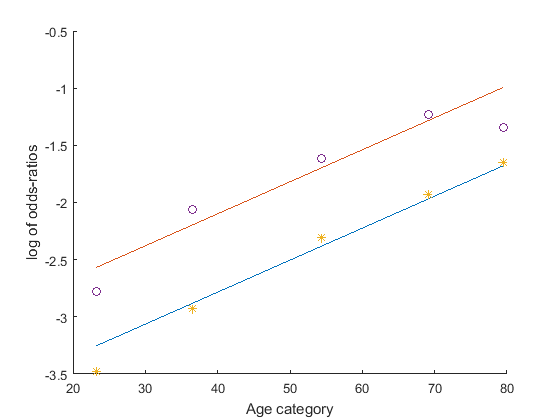
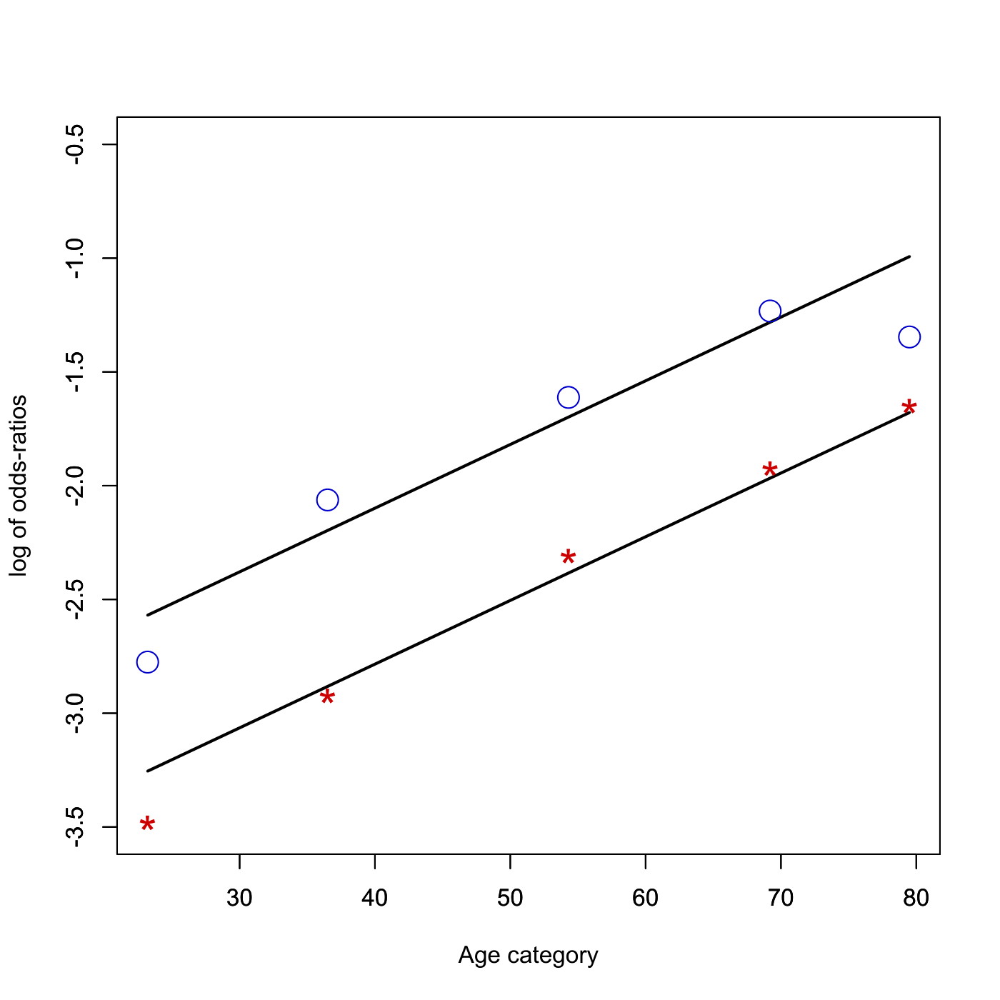
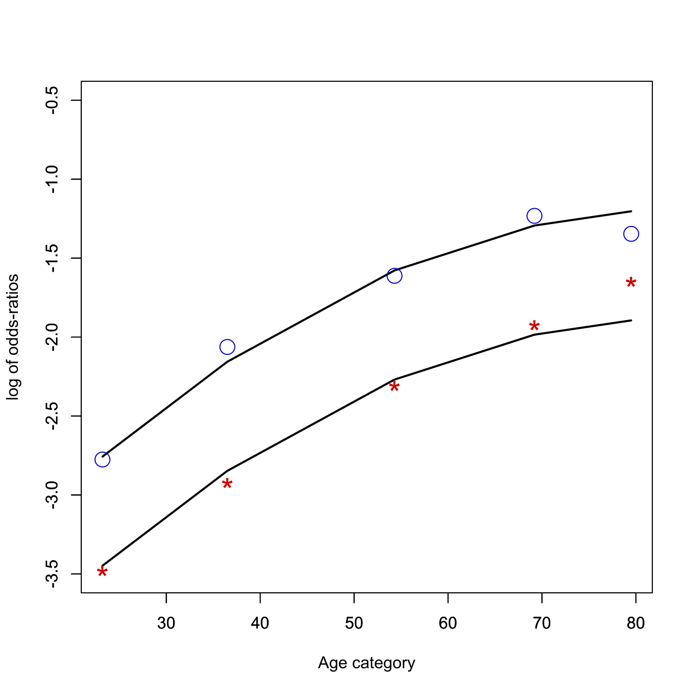
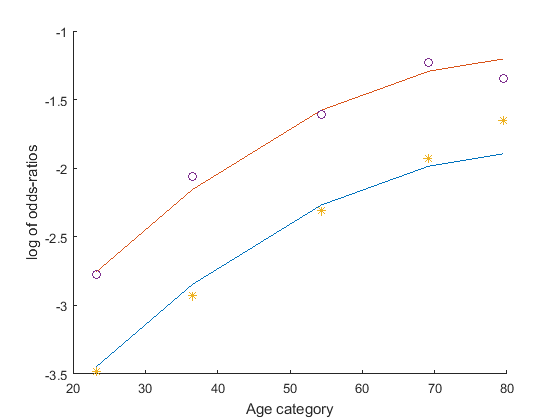

[](http://quantlet.de/)

## [](http://quantlet.de/) **MVAdrugLogistic** [](http://quantlet.de/)

```yaml

Name of QuantLet: MVAdrugLogistic

Published in: Applied Multivariate Statistical Analysis

Description: Calculates and plots the odds-ratios of the probability of taking drugs in a logit model for a gender-age group combination and tests two models (one without a curvature and more general model with a curvature term).

Keywords: probability, logit, plot, graphical representation, regression

See also: MVAdrug3waysTab, MVAdrug

Author: Awdesch Melzer

Submitted: Wed, April 04 2012 by Dedy Dwi Prastyo
Submitted[Matlab]: Thu, December 08 2016 by Piedad Castro

Example: Fit of the log of the odds-ratios for taking drugs. Men are the stars and women are the circles.


```









### MATLAB Code
```matlab

%% clear all variables and console and close windows
clear
clc
close all

%% Drug data
zi = [1, 0, 1, 0, 1, 0, 0, 0, 0, 21;
      1, 0, 1, 0, 0, 1, 0, 0, 0, 32;
      1, 0, 1, 0, 0, 0, 1, 0, 0, 70;
      1, 0, 1, 0, 0, 0, 0, 1, 0, 43;
      1, 0, 1, 0, 0, 0, 0, 0, 1, 19;
      1, 0, 0, 1, 1, 0, 0, 0, 0, 683;
      1, 0, 0, 1, 0, 1, 0, 0, 0, 596;
      1, 0, 0, 1, 0, 0, 1, 0, 0, 705;
      1, 0, 0, 1, 0, 0, 0, 1, 0, 295;
      1, 0, 0, 1, 0, 0, 0, 0, 1, 99;
      0, 1, 1, 0, 1, 0, 0, 0, 0, 46;
      0, 1, 1, 0, 0, 1, 0, 0, 0, 89;
      0, 1, 1, 0, 0, 0, 1, 0, 0, 169;
      0, 1, 1, 0, 0, 0, 0, 1, 0, 98;
      0, 1, 1, 0, 0, 0, 0, 0, 1, 51;
      0, 1, 0, 1, 1, 0, 0, 0, 0, 738;
      0, 1, 0, 1, 0, 1, 0, 0, 0, 700;
      0, 1, 0, 1, 0, 0, 1, 0, 0, 847;
      0, 1, 0, 1, 0, 0, 0, 1, 0, 336;
      0, 1, 0, 1, 0, 0, 0, 0, 1, 196];
  
y = zi(:, 10); % number of obs per cell

%% design matrix
I = 2; % sex M - F
J = 2; % drug Yes - No
K = 5; % age category 16-29, 30-44, 45-64, 65-74, 75++
%
%%  Mean age per group: for Men and for Women
average = [23.2 36.5 54.3 69.2 79.5 23.2 36.5 54.3 69.2 79.5]';

%%   Design Matrix
X = [1   1    
     1   1  
     1   1 
     1   1      
     1   1     
     1  -1     
     1  -1      
     1  -1      
     1  -1      
     1  -1];

%%  Age
X        = [X  average];
[n,npar] = size(X);
df       = n - npar;

Xform = [];
for i = 1:n
   temp  = sprintf('%10.2f', X(i,:));
   Xform = [Xform; temp];
end

label = zi(:, 3)==1;
n1jk  = y(label);
label = zi(:, 3)==0;
n2jk  = y(label);
b0    = 0 * ones(npar, 1);

%% max likelihood in log-lin models
% y is the effective in each cell
% X*b is the expected value in cell if b is the current value
lnliklogist = @(b) -sum(n1jk.*log(ones(size(n1jk))./(ones(size(n1jk)) + exp(-X*b)))) - sum(n2jk.*log(ones(size(ones(size(n1jk))./(ones(size(n1jk))+exp(-X*b))))-ones(size(n1jk))./(ones(size(n1jk)) + exp(-X*b))))

iter   = 100;
opt    = [1 1e-2 1e-2 1e-4  0 0 0 0 0 0 0 0 0 iter 0 0 0 1];
[b, ~] = fminsearch(lnliklogist, b0)
N      = sum(y)
p1     = ones(size(n1jk))./(ones(size(n1jk)) + exp(-X*b));
p2     = ones(size(n2jk))./(ones(size(n2jk)) + exp(X*b));
nfit   = [(n1jk + n2jk).*p1 ;  (n1jk + n2jk).*p2];
nobs   = [n1jk; n2jk];
e      = log(nobs) - log(nfit);

disp('degree of freedom')
disp(df)

G2     = 2 * sum(nobs.*e)
pvalG2 = 1 - chi2cdf(G2, df)
X2     = sum(((nobs-nfit).^2)./nfit)
pvalG2 = 1 - chi2cdf(G2, df)

disp(' ')
disp('  observed    fitted')
disp('    values    values')
disp([nobs  nfit])
disp(' ')
disp('design matrix')
disp(Xform)

oddratfit = log(p1./p2);
oddrat    = log(n1jk./n2jk);

%% plot
figure(1)
hold on
plot(X(1:K,3), oddratfit(1:K), '-', X(K+1:2*K,3), oddratfit(K+1:2*K),
     '-', X(1:K, 3), oddrat(1:K), '*', X(K+1:2*K,3), oddrat(K+1:2*K), 'o')
xlabel('Age category')
ylabel('log of odds-ratios')
hold off

%% calculate model with age*age
X = [1   1    
     1   1  
     1   1 
     1   1      
     1   1     
     1  -1     
     1  -1      
     1  -1      
     1  -1      
     1  -1];
 
%%  Age and Age^2
X = [X  average average.*average];

[n, npar] = size(X);
df2       = n - npar;

Xform = [];
for i=1:n
   temp  = sprintf('%10.2f',X(i,:));
   Xform = [Xform;temp];
end

label = zi(:,3)==1;
n1jk  = y(label);
label = zi(:,3)==0;
n2jk  = y(label);
b0    = 0*ones(npar,1);

%% max likelihood in log-lin models
% y is the effective in each cell
% X*b is the expected value in cell if b is the current value
lnliklogist = @(b) -sum(n1jk.*log(ones(size(n1jk))./(ones(size(n1jk))+exp(-X*b)))) - sum(n2jk.*log(ones(size(ones(size(n1jk))./(ones(size(n1jk))+exp(-X*b))))-ones(size(n1jk))./(ones(size(n1jk))+exp(-X*b))))

iter  = 100;
opt   = [1 1e-2 1e-2 1e-4  0 0 0 0 0 0 0 0 0 iter 0 0 0 1];
[b,~] = fminsearch(lnliklogist,b0)
N     = sum(y)
p1    = ones(size(n1jk))./(ones(size(n1jk))+exp(-X*b));
p2    = ones(size(n2jk))./(ones(size(n2jk))+exp(X*b));
nfit  = [(n1jk+n2jk).*p1 ;  (n1jk+n2jk).*p2];
nobs  = [n1jk ;n2jk];
e     = log(nobs)-log(nfit);

disp('degree of freedom')
disp(df2)

GG2     = 2*sum(nobs.*e)
pvalG2  = 1- chi2cdf(GG2,df2)
X2      = sum(((nobs-nfit).^2)./nfit)
pvalGG2 = 1- chi2cdf(GG2,df2)

disp(' ')
disp('  observed    fitted')
disp('    values    values')
disp([nobs  nfit])
disp(' ')
disp('design matrix')
disp(Xform)
oddratfit = log(p1./p2);
oddrat = log(n1jk./n2jk);

%% plot
figure(2)
hold on
plot(X(1:K,3),oddratfit(1:K),'-',X(K+1:2*K,3),oddratfit(K+1:2*K),'-',...
   X(1:K,3),oddrat(1:K),'*',X(K+1:2*K,3),oddrat(K+1:2*K),'o')
xlabel('Age category')
ylabel('log of odds-ratios')
hold off
overallG2     = G2-GG2
pvalG2        = 1- chi2cdf(overallG2,df-df2)
pvaloverallG2 = 1- chi2cdf(overallG2,df-df2)

```

automatically created on 2018-05-28

### R Code
```r


# clear all variables
rm(list = ls(all = TRUE))
graphics.off()

# Drug data
zi = rbind(c(1, 0, 1, 0, 1, 0, 0, 0, 0, 21), c(1, 0, 1, 0, 0, 1, 0, 0, 0, 32), c(1, 
    0, 1, 0, 0, 0, 1, 0, 0, 70), c(1, 0, 1, 0, 0, 0, 0, 1, 0, 43), c(1, 0, 1, 0, 
    0, 0, 0, 0, 1, 19), c(1, 0, 0, 1, 1, 0, 0, 0, 0, 683), c(1, 0, 0, 1, 0, 1, 0, 
    0, 0, 596), c(1, 0, 0, 1, 0, 0, 1, 0, 0, 705), c(1, 0, 0, 1, 0, 0, 0, 1, 0, 295), 
    c(1, 0, 0, 1, 0, 0, 0, 0, 1, 99), c(0, 1, 1, 0, 1, 0, 0, 0, 0, 46), c(0, 1, 1, 
        0, 0, 1, 0, 0, 0, 89), c(0, 1, 1, 0, 0, 0, 1, 0, 0, 169), c(0, 1, 1, 0, 0, 
        0, 0, 1, 0, 98), c(0, 1, 1, 0, 0, 0, 0, 0, 1, 51), c(0, 1, 0, 1, 1, 0, 0, 
        0, 0, 738), c(0, 1, 0, 1, 0, 1, 0, 0, 0, 700), c(0, 1, 0, 1, 0, 0, 1, 0, 
        0, 847), c(0, 1, 0, 1, 0, 0, 0, 1, 0, 336), c(0, 1, 0, 1, 0, 0, 0, 0, 1, 
        196))
y = zi[, 10]

# Design matrix
I = 2  # sex M - F
J = 2  # drug Yes - No
K = 5  # age category 16-29, 30-44, 45-64, 65-74, 75++

# Mean age per group: for Men and for Women
average = c(c(23.2, 36.5, 54.3, 69.2, 79.5), c(23.2, 36.5, 54.3, 69.2, 79.5))
X   = rbind(c(1, 1), c(1, 1), c(1, 1), c(1, 1), c(1, 1), c(1, -1), c(1, -1), c(1, -1), 
    c(1, -1), c(1, -1))
X1  = cbind(X, average)  # Xi=design matrix for group i=1,2

n   = dim(X1)
n1  = n[1]
n2  = n[2]
df  = n1 - n2

label = zi[, 3] == 1
n1jk  = y[label]  # nijk is the effective in each cell, i=1,2
label = zi[, 3] == 0
n2jk  = y[label]

b0 = 0 * rep(1, n2)  # current value of beta

# max likelihood in logistic models for 3-way contingency tables
ff = function(b0) {
    -sum(n1jk * log(matrix(1, length(n1jk), 1)/(matrix(1, length(n1jk), 1) + exp(-X1 %*% 
        b0)))) - sum(n2jk * log(matrix(1, dim(matrix(1, length(n1jk), 1)/(matrix(1, 
        length(n1jk), 1) + exp(-X1 %*% b0)))) - matrix(1, length(n1jk), 1)/(matrix(1, 
        length(n1jk), 1) + exp(-X1 %*% b0))))
}
(b      = optim(b0, ff)$par)
loglik  = optim(b0, ff)$value
N       = sum(y)
p1      = matrix(1, length(n1jk), 1)/(matrix(1, length(n1jk), 1) + exp(-X1 %*% b))
p2      = matrix(1, length(n2jk), 1)/(matrix(1, length(n2jk), 1) + exp(X1 %*% b))
nfit    = rbind((n1jk + n2jk) * p1, (n1jk + n2jk) * p2)
nobs    = c(n1jk, n2jk)
e       = log(nobs) - log(nfit)
print("degree of freedom")
print(df)
(G2     = 2 * sum(nobs * e))
(pvalG2 = 1 - pchisq(G2, df))
(chi2   = sum(((nobs - nfit)^2)/nfit))
(pvalG2 = 1 - pchisq(G2, df))
print(" ")
print("  observed    fitted")
print("    values    values")
cbind(nobs, nfit)
print(" ")

oddratfit = log(p1/p2)
oddrat    = log(n1jk/n2jk)
plot(X1[1:K, 3], oddratfit[1:K], type = "l", ylim = c(-3.5, -0.5), ylab = "", xlab = "", 
    lwd = 2)
par(new = TRUE)
plot(X1[(K + 1):(2 * K), 3], oddratfit[(K + 1):(2 * K)], type = "l", ylim = c(-3.5, 
    -0.5), xlab = "Age category", ylab = "log of odds-ratios", lwd = 2)
points(X1[1:K, 3], oddrat[1:K], pch = "*", cex = 2, col = "red3")
points(X1[(K + 1):(2 * K), 3], oddrat[(K + 1):(2 * K)], cex = 2, col = "blue3")
title(paste("Fit of the log of the odds-ratios "))

# logistic model with curvature term: log(y)~gender + age + age^2
(X2 = cbind(X, average, average * average))
n   = dim(X2)
n1  = n[1]
n2  = n[2]
df2 = n1 - n2

label = zi[, 3] == 1
n1jk  = y[label]
label = zi[, 3] == 0
n2jk  = y[label]

b0 = 0 * rep(1, n2)

f2 = function(b0) {
    -sum(n1jk * log(matrix(1, length(n1jk), 1)/(matrix(1, length(n1jk), 1) + exp(-X2 %*% 
        b0)))) - sum(n2jk * log(matrix(1, dim(matrix(1, length(n1jk), 1)/(matrix(1, 
        length(n1jk), 1) + exp(-X2 %*% b0)))) - matrix(1, length(n1jk), 1)/(matrix(1, 
        length(n1jk), 1) + exp(-X2 %*% b0))))
}
(b = optim(b0, f2)$par)

loglik  = optim(b0, f2)$value
N       = sum(y)
p1      = matrix(1, length(n1jk), 1)/(matrix(1, length(n1jk), 1) + exp(-X2 %*% b))
p2      = matrix(1, length(n2jk), 1)/(matrix(1, length(n2jk), 1) + exp(X2 %*% b))
nfit    = rbind((n1jk + n2jk) * p1, (n1jk + n2jk) * p2)
nobs    = c(n1jk, n2jk)
e       = log(nobs) - log(nfit)
print("degree of freedom")
print(df2)
(GG2      = 2 * sum(nobs * e))
(pvalGG2  = 1 - pchisq(GG2, df2))
(chi2     = sum(((nobs - nfit)^2)/nfit))
(pvalG2   = 1 - pchisq(GG2, df2))
print(" ")
print("  observed    fitted")
print("    values    values")
cbind(nobs, nfit)
print(" ")

oddratfit = log(p1/p2)
oddrat    = log(n1jk/n2jk)
dev.new()
plot(X2[1:K, 3], oddratfit[1:K], type = "l", ylim = c(-3.5, -0.5), ylab = "", xlab = "", 
    lwd = 2)
par(new = TRUE)
plot(X2[(K + 1):(2 * K), 3], oddratfit[(K + 1):(2 * K)], type = "l", ylim = c(-3.5, 
    -0.5), xlab = "Age category", ylab = "log of odds-ratios", lwd = 2)
points(X2[1:K, 3], oddrat[1:K], pch = "*", cex = 2, col = "red3")
points(X2[(K + 1):(2 * K), 3], oddrat[(K + 1):(2 * K)], cex = 2, col = "blue3")
title(paste("Fit of the log of the odds-ratios "))

# test model one against model two
print("degree of freedom")
print(df - df2)
(overallG2  = G2 - GG2)
(pvaloG2    = 1 - pchisq(overallG2, df - df2)) 

```

automatically created on 2018-05-28