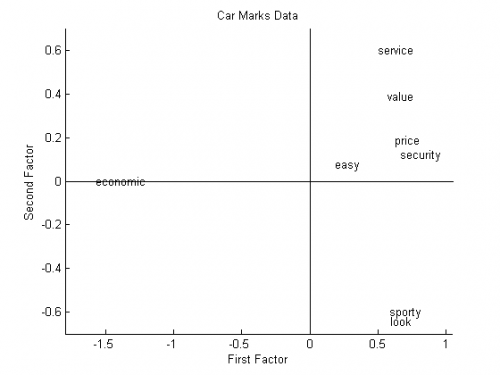

[](http://quantlet.de/)

## [](http://quantlet.de/) **MVAfactcarm** [](http://quantlet.de/)

```yaml


Name of QuantLet: MVAfactcarm

Published in: Applied Multivariate Statistical Analysis

Description: 'Performs a factor analysis for the car marks data and shows the eigenvalues of r-psi and a plot of the factor loadings for the first two factors.'

Keywords: eigenvalues, factor, factor analysis, factor-loadings, spectral-decomposition, data visualization, plot, graphical representation, financial, sas

See also: SMSfactbank, SMSfactfood, SMSfacthletic, SMSfactsigma, SMSfactushealth, MVAdecofood, SMSdecobank 

Author: Zografia Anastasiadou, Awdesch Melzer
Author[SAS]: Svetlana Bykovskaya

Submitted: Wed, June 04 2014 by Felix Jung
Submitted[SAS]: Wen, April 6 2016 by Svetlana Bykovskaya

Datafiles: carmean.dat, carmean_sas.dat

```




### R Code
```r


# clear variables and close windows
rm(list = ls(all = TRUE))
graphics.off()


# Note: R decomposes matrices differently from Matlab and Xplore, and hence some
# of the eigenvectors have different signs. This does not change the results, but
# it does change the order of the graph by inverting the axes around the origin
# (Not always, and not necessarily all of the axis; it depends on which
# eigenvectors we choose to plot)


# load data
xdat = read.table("carmean.dat")

# delete first column
x = xdat[, -1]

# define variable names
colnames(x) = c("economic", "service", "value", "price", "look", "sporty", "security", 
    "easy")

# correlation matrix
r = cor(x)
m = r

for (i in 1:ncol(r)) {
    m[i, i] = r[i, i] - 1
}

psi = matrix(1, 8, 8)
for (i in 1:8) {
    psi[i, i] = 1 - max(abs(m[, i]))
}

# spectral decomposition
eig = eigen(r - psi)
ee  = eig$values[1:2]
vv  = eig$vectors[, 1:2]
vv  = t(t(vv[, 1:2]) * sign(vv[2, 1:2]))
q1  = sqrt(ee[1]) * vv[, 1]
q2  = sqrt(ee[2]) * vv[, 2]
q   = cbind(q1, q2)

# plot
plot(q, type = "n", xlab = "First Factor", ylab = "Second Factor", main = "Car Marks Data", 
    xlim = c(-1.8, 1), ylim = c(-0.7, 0.7), cex.lab = 1.4, cex.axis = 1.4, cex.main = 1.8)
text(q, colnames(x), cex = 1.2, xpd = NA)
abline(v = 0)
abline(h = 0)

```

automatically created on 2018-05-28

### MATLAB Code
```matlab

% ---------------------------------------------------------------------
% Book:         MVA
% ---------------------------------------------------------------------
% Quantlet:     MVAfactcarm
% ---------------------------------------------------------------------
% Description:  MVAfactcarm performs a factor analysis for the car marks
%               data (carmean.dat) and shows the eigenvalues of r-psi
%               and a plot of the factor loadings for the first two 
%               factors. 
%               Corresponds to example 11.4 in MVA.
% ---------------------------------------------------------------------
% Usage:        -
% ---------------------------------------------------------------------
% Inputs:       None
% ---------------------------------------------------------------------
% Output:       Factor analysis for the car marks data (carmean.dat)
%               and shows the eigenvalues of r-psi and a plot of the
%               factor loadings for the first two factors.
% ---------------------------------------------------------------------
% Example:      -
% ---------------------------------------------------------------------
% Author:       Wolfgang Haerdle, Jorge Patron, Vladimir Georgescu,
%               Song Song
% ---------------------------------------------------------------------

%Note: Matlab decomposes matrices differently from Xplore, and
%hence some of the eigenvectors have different signs. This does not change
%the results, but it does change the order of the graph by inverting the
%axes around the origin (Not always, and not necessarily all of the axis;
%it depends on which eigenvectors we choose to plot)
close all
clear
clc
% Reading a file that does not contain only numerical data
[Type, A, B, C, D, E, F, G, H] = textread('carmean.dat','%s %f %f %f %f %f %f %f %f');
% Constructing matrix with data
x                      = horzcat(A,B,C,D,E,F,G,H);
r                      = corr(x);
m                      = r;
for i=1:length(r)
    m(i,i) = r(i,i)-1;
end
psi(1:8,1:8) = 1;
for i=1:8
    psi(i,i) = 1-max(abs(m(:,i)));
end
% Arranging eigenvalues and eigenvectors
[v, e1] = eigs(r-psi,8,'la');  % Returns eigenvalues and eigenvectors sorted by size
e       = (e1*ones(8,1))';          % Turns Eigenvalue matrix into a row vector
ee      = e(1:2);
vv      = v(:,1:2);
q       = sqrt(ee(1))*vv(:,1);
q(:,2)  = sqrt(ee(2))*vv(:,2);
scatter(q(:,1),q(:,2),'w')
hold on
s = ['economic'
     'service '
     'value   '
     'price   '
     'look    '
     'sporty  '
     'security'
     'easy    '];
for i=1:8
    text(q(i,1),q(i,2),s(i,1:8));
end;
xlim([-1.8 1.05])
ylim([-0.7 0.7])
line([-2 1.2],[0 0],'Color','k')
line([0 0],[1.2 -1.2],'Color','k')
title('Car Marks Data');
xlabel('First Factor');
ylabel('Second Factor');
hold off

```

automatically created on 2018-05-28

### SAS Code
```sas

* Import the data;
data carmean;
  infile '/folders/myfolders/data/carmean.dat';
  input temp1 $ temp2-temp9;
run;

proc iml;
  * Read data into a matrix;
  use carmean;
    read all var _ALL_ into x; 
  close carmean;
  
  colnames = {"economic", "service", "value", "price", "look", "sporty", "security", 
    "easy"}; 
  
  * correlation matrix;
  r = corr(x);
  m = r;
  
  do i = 1 to ncol(r);
    m[i, i] = r[i, i] - 1;
  end;
  
  psi = j(8,8,1);
  
  do i = 1 to 8;
    psi[i, i] = 1 - max(abs(m[, i]));
  end;
  
  * spectral decomposition;
  eig = r - psi;
  ee  = eigval(eig)[1:2];
  vv  = eigvec(eig)[, 1:2];
  vv  = vv[, 1:2] # sign(vv[2, 1:2]);
  q1  = sqrt(ee[1]) # vv[, 1];
  q2  = sqrt(ee[2]) # vv[, 2];

  create plot var {"q1" "q2" "colnames"};
    append;
  close plot;
quit;

proc sgplot data = plot
    noautolegend;
  title 'Car Marks Data';
  scatter x = q1 y = q2 / markerattrs = (color = blue symbol = circlefilled)
    datalabel = colnames;
  refline 0 / lineattrs = (color = black);
  refline 0 / axis = x lineattrs = (color = black);
  xaxis label = 'First Factor';
  yaxis label = 'Second Factor';
run;

```

automatically created on 2018-05-28