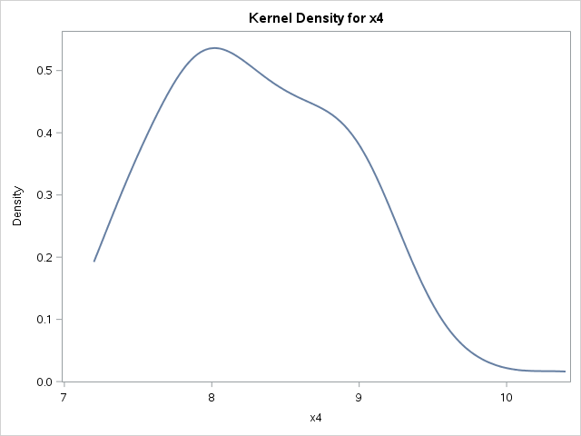
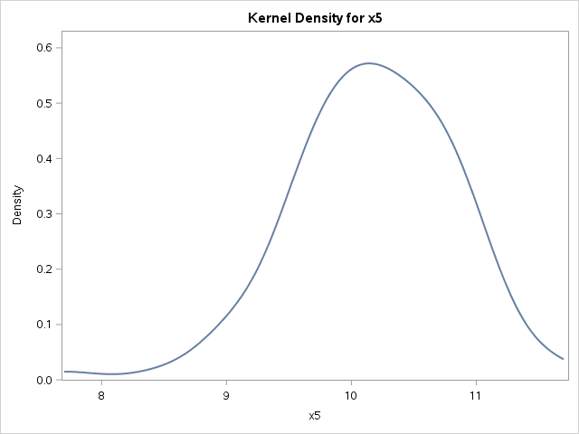
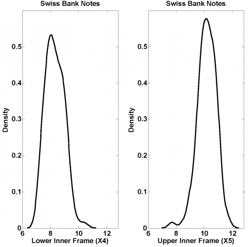

[](http://quantlet.de/)

## [](http://quantlet.de/) **MVAdenbank2** [](http://quantlet.de/)

```yaml


Name of QuantLet: MVAdenbank2

Published in: Applied Multivariate Statistical Analysis

Description: 'Computes the univariate densities of X4 and X5 of the genuine Swiss bank notes.'

Keywords: data visualization, plot, graphical representation, financial, density, descriptive, descriptive-statistics, empirical, smoothing, gaussian, kde, kernel, visualization, sas

See also: MVAcontbank3, MVAdenbank, MVAdenbank3, MVAscabank45, MVAscabank456, SPMdenepatri, SPMkdeconstruct, SPMkernel

Author: Zografia Anastasiadou
Author[SAS]: Svetlana Bykovskaya

Submitted: Tue, September 09 2014 by Awdesch Melzer
Submitted[SAS]: Tue, April 5 2016 by Svetlana Bykovskaya
Submitted[Matlab]: Tue, November 22 2016 by Lily Medina

Datafiles: bank2.dat

Example: 'Univariate estimates of the density X4 (left) and X5 (right) of the bank notes.'

```








### R Code
```r


# clear variables and close windows
rm(list = ls(all = TRUE))
graphics.off()

# Observation: Density estimates are different because R uses a 'gaussian' kernel as default, whereas Xplore uses a Quartic Kernel.

# load data
x = read.table("bank2.dat")

x4 = x[1:100, 4]
x5 = x[1:100, 5]

f4 = density(x4)
f5 = density(x5)

# plot
par(mfrow = c(1, 2))
plot(f4, type = "l", lwd = 3, xlab = "Lower Inner Frame (X4)", ylab = "Density", main = "Swiss bank notes", 
    cex.lab = 1.2, cex.axis = 1.2, cex.main = 1.8)
plot(f5, type = "l", lwd = 3, xlab = "Upper Inner Frame (X5)", ylab = "Density", main = "Swiss bank notes", 
    cex.lab = 1.2, cex.axis = 1.2, cex.main = 1.8)
	
```

automatically created on 2018-05-28

### MATLAB Code
```matlab

%% clear loaded variables and close windows
clear all
close all
clc

%% load data
x  = load('bank2.dat')
x4 = x(1:100,4);
x5 = x(1:100,5);

[f1,xi1] = ksdensity(x4);
[f2,xi2] = ksdensity(x5);

%% plot
hold on
subplot(1,2,1)
plot(xi1,f1,'k','linewidth',2)
title('Swiss Bank Notes')
xlabel('Lower Inner frame (x4)')
ylabel('Density')
subplot(1,2,2)

plot(xi2,f2,'k','linewidth',2)
title('Swiss Bank Notes')
xlabel('Upper Inner Frame (X5)')
ylabel('Density')
hold off

```

automatically created on 2018-05-28

### SAS Code
```sas


* Import the data;
data bank2;
  infile '/folders/myfolders/data/bank2.dat';
  input temp1-temp6;
run;

proc iml;
  * Read data into a matrix;
  use bank2;
    read all var _ALL_ into x; 
  close bank2;
  
  x4 = x[1:100, 4];
  x5 = x[1:100, 5];
  
  create plot var {"x4" "x5"};
    append;
  close plot;
quit;

ods graphics on;

proc kde data = plot;
  title 'Swiss bank notes';
  univar x4 / plots = (densityoverlay) noprint;
  univar x5 / plots = (densityoverlay) noprint;
run;

ods graphics off;

```

automatically created on 2018-05-28