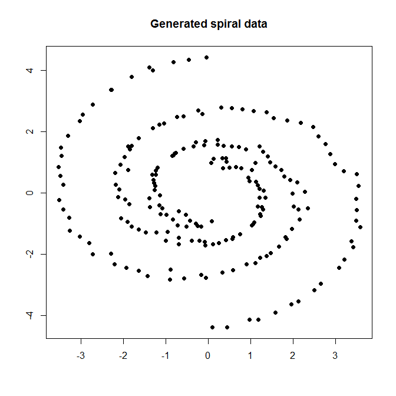
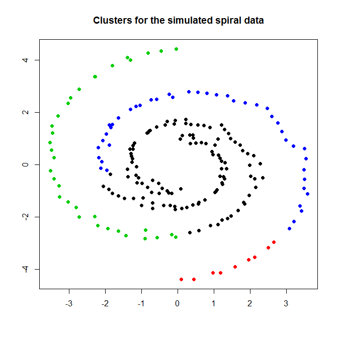

[](http://quantlet.de/)

## [](http://quantlet.de/) **MVAspecclustspiral** [](http://quantlet.de/)

```yaml

Name of Quantlet: MVAspecclustspiral

Published in: Applied Multivariate Statistical Analysis

Description: 'Simulates a spiral dataset and clusters it in four groups by 
              means of a spectral clustering algorithm. It plots the simulated data and 
              its clusters'

Keywords:     spectral clustering, partitioning, proximity, cluster, grouping,
              normalized cut, cut cost, fMRI  

Author:       Awdesch Melzer, Simon Trimborn

Submited:     Wed, Dec 07 2016 by Piedad Castro

Output:       'Plots of data and the derived clusters'

```





### R Code
```r

# clear all variables and close windows
rm(list = ls(all = TRUE))
graphics.off()

# install and load packages
libraries = c("kernlab", "tseries", "quadprog", "zoo")
lapply(libraries, function(x) if (!(x %in% installed.packages())) {
  install.packages(x)
})
lapply(libraries, library, quietly = TRUE, character.only = TRUE)
  
set.seed(0) 

tetha = seq(length=100, from=0, to=3)
a     = 1
b     = 0.5 	 # b is near to zero, spiral approaches a circle
r     = a*exp(b*tetha)

# X(+1) members of first group, centering in (c1p,c2p)
c1p = 0
c2p = 0
X1p = c1p + r*cos(tetha*pi)
X2p = c2p + r*sin(tetha*pi)

# X(-1) members of second group, centering in (c1n,c2n)
c1n = 1
c2n = 0
X1n = 1 - (c1n + r*cos(tetha*pi))
X2n = - (c2n + r*sin(tetha*pi))

# Agregating data
X1 = c(X1p, X1n)
X2 = c(X2p, X2n)

# generating indicator variable
yp = rep(1, 100)
yn = rep(-1, 100)
Y  = c(yp,yn)

# Generating noise, N(0,0.01)
e  = rnorm(200, mean = 0, sd = 0.1)
X1 = X1 + e
X2 = X2 + e

Spiral.noise = cbind(X2, X1)  

# clusters for generated spiral data
sc = specc(Spiral.noise, centers=4)

# Plots
windows()
plot(Spiral.noise, col="black", xlab="",ylab="", lwd=2, pch=16)
title("Simulated spiral data")
windows()
plot(Spiral.noise, col=sc, xlab="",ylab="", lwd=2, pch=16)
title("Clusters for the simulated spiral data")

```

automatically created on 2018-05-28